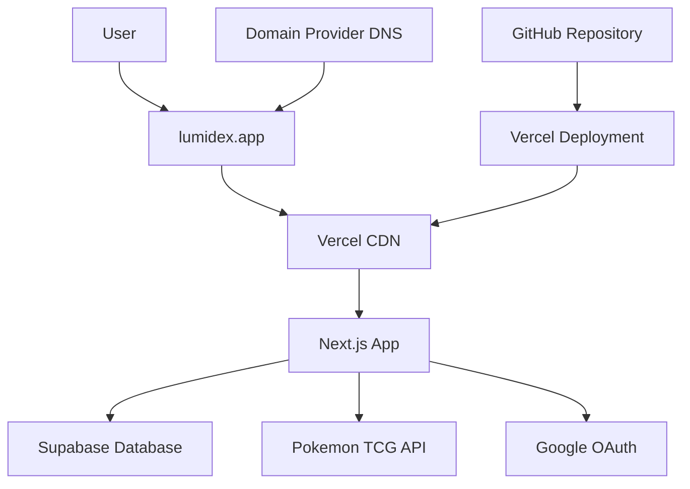

# Lumidex Domain Setup Summary

## 📋 What We've Prepared

You now have a complete deployment architecture for setting up your Lumidex Pokemon card collection application with the `lumidex.app` domain. Here's what's been created:

### 📚 Documentation Created

1. **[DEPLOYMENT_GUIDE.md](./DEPLOYMENT_GUIDE.md)** - Complete step-by-step deployment guide
2. **[README.md](./README.md)** - Comprehensive project documentation  
3. **[SETUP_CHECKLIST.md](./SETUP_CHECKLIST.md)** - Concise deployment checklist
4. **[DOMAIN_SETUP_SUMMARY.md](./DOMAIN_SETUP_SUMMARY.md)** - This summary document

### 🎯 Current Status

**What you have:**
- ✅ Lumidex application code ready to deploy
- ✅ Domain `lumidex.app` owned
- ✅ GitHub and Vercel accounts ready
- ✅ Supabase backend configured
- ✅ Pokemon TCG API integration
- ✅ Google OAuth setup
- ✅ Complete deployment documentation

**What needs to be done:**
- [ ] Create GitHub repository and push code
- [ ] Set up Vercel project with environment variables
- [ ] Configure custom domain and DNS
- [ ] Update authentication settings
- [ ] Deploy and test

## 🚀 Next Steps (Implementation Phase)

### Immediate Actions Needed

1. **Create GitHub Repository**
   - Repository name: `lumidex`
   - Visibility: Public (for free Vercel deployment)
   - Push your current code

2. **Set up Vercel Project**
   - Import from GitHub
   - Configure environment variables
   - Deploy initial version

3. **Configure Domain**
   - Add `lumidex.app` in Vercel
   - Update DNS records with your domain provider
   - Wait for DNS propagation

4. **Update Authentication**
   - Supabase: Update Site URL and redirect URLs
   - Google OAuth: Add production redirect URIs

5. **Test & Verify**
   - Comprehensive functionality testing
   - Performance verification
   - Security checks

### Time Estimates

- **GitHub setup**: 15 minutes
- **Vercel configuration**: 30 minutes  
- **Domain/DNS setup**: 15 minutes (+ 24-48 hours propagation)
- **Authentication updates**: 20 minutes
- **Testing & verification**: 1-2 hours
- **Total active time**: ~2 hours + DNS wait time

## 🔧 Environment Variables Required

Your Vercel project will need these environment variables:

```env
# Supabase (already configured)
NEXT_PUBLIC_SUPABASE_URL=https://xwlmuufqiscsdegiszyr.supabase.co
NEXT_PUBLIC_SUPABASE_ANON_KEY=[your-anon-key]
SUPABASE_SERVICE_ROLE_KEY=[your-service-role-key]

# Pokemon TCG API (already have)
POKEMON_TCG_API_KEY=d21064be-f874-428d-9f0b-d6780fb2b2bd

# Production Configuration
NEXT_PUBLIC_APP_URL=https://lumidex.app
NEXT_PUBLIC_APP_NAME=Lumidex - European Card Tracker
NODE_ENV=production

# Google OAuth (already configured)
NEXT_PUBLIC_GOOGLE_OAUTH_CLIENT_ID=296510934037-6bk8662fu3sbfhfajc143s6knm5jk5n7.apps.googleusercontent.com

# Optional (can be empty initially)
NEXT_PUBLIC_GOOGLE_ANALYTICS_ID=
SENTRY_DSN=
```

## 🌐 DNS Configuration Required

Configure these DNS records with your domain provider:

**Root domain (lumidex.app):**
```
Type: A
Name: @
Value: 76.76.19.61
TTL: 3600
```

**WWW subdomain:**
```
Type: CNAME  
Name: www
Value: cname.vercel-dns.com
TTL: 3600
```

## 📊 Architecture Overview



## ✅ Success Criteria

Your deployment will be successful when:

- ✅ `https://lumidex.app` loads without errors
- ✅ User authentication works (email + Google OAuth)
- ✅ Pokemon card search and display functions
- ✅ Collection management features work
- ✅ Trading and social features accessible
- ✅ Mobile responsive design functions properly
- ✅ Page load times under 3 seconds
- ✅ SSL certificate valid and secure

## 🛠️ Tools & Resources Needed

- **GitHub account** (already have)
- **Vercel account** (already have)
- **Domain DNS management** (your domain provider dashboard)
- **Supabase dashboard** (for auth configuration)
- **Google Cloud Console** (for OAuth updates)

## 📞 Support Resources

- **Deployment Guide**: Follow [DEPLOYMENT_GUIDE.md](./DEPLOYMENT_GUIDE.md) for detailed steps
- **Quick Checklist**: Use [SETUP_CHECKLIST.md](./SETUP_CHECKLIST.md) for step-by-step verification
- **Troubleshooting**: Common issues and solutions included in both guides
- **Performance**: Optimization tips and monitoring setup

## 🎯 Recommended Implementation Order

1. **Start with GitHub** - Get your code repository set up first
2. **Configure Vercel** - Set up hosting and environment variables  
3. **Deploy to test URL** - Verify everything works on Vercel subdomain
4. **Add custom domain** - Configure lumidex.app domain
5. **Update authentication** - Configure production URLs
6. **Test comprehensively** - Full functionality verification

## 📝 Notes

- DNS propagation can take 24-48 hours globally
- Test with temporary Vercel URL while DNS propagates
- Keep your local `.env.local` file - don't commit it to GitHub
- Vercel automatically handles SSL certificates and HTTPS redirect
- Your existing Supabase database and Pokemon TCG API setup will work seamlessly

---

## Ready for Implementation?

You now have everything needed to deploy Lumidex to production with your `lumidex.app` domain. The documentation provides:

- **Complete guidance** for every step
- **Troubleshooting help** for common issues
- **Security best practices** built-in
- **Performance optimization** configured
- **Monitoring and maintenance** guidelines

Switch to **Code mode** when you're ready to begin implementation, and you can use these guides to deploy your application to production!

---

*This summary was created for deploying Lumidex Pokemon card collection app to lumidex.app*