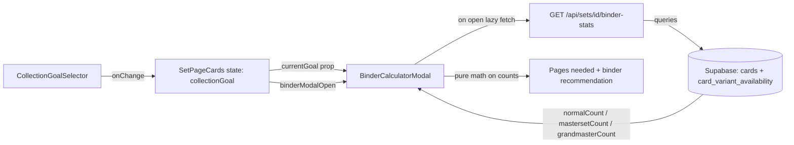

# Binder Calculator Feature Plan

## Overview

Add a **Binder Guide** button to the set detail page (`/set/[id]`) that opens a modal showing users exactly how many binder pages and what binder size they need to store their target set, calculated based on the active **Collection Goal** (Normal Set / Masterset / Grandmaster Set).

---

## Card Count Logic Per Goal

| Goal | What counts | Rule |
|---|---|---|
| **Normal Set** | `set.setComplete` | One slot per unique card (any variant counts) |
| **Masterset** | Sum of variants for all non-promo cards | Normal+Reverse (2) for common; Reverse+Holo (2) for holo rares; Holo only (1) for EX/V/Secrets |
| **Grandmaster Set** | Sum of variants for ALL cards (incl. promos) | Same variant logic, applied to all cards including promo-rarity ones |

**Override rule**: If a card has rows in `card_variant_availability`, use that count instead of rarity rules.

---

## Architecture

### Data Flow

```
Set Page (server) ──► SetPageCards (client)
                           │
                    [Binder Guide button]
                           │
                    BinderCalculatorModal
                           │  (on open, lazy fetch)
                           ▼
              GET /api/sets/[id]/binder-stats
                           │
                    ┌──────┴──────────────────────┐
                    │  cards + card_variant_        │
                    │  availability for the set    │
                    └──────────────────────────────┘
                           │
                    { normalCount, mastersetCount, grandmasterCount }
```

---

## Files to Create / Modify

### 1. `app/api/sets/[id]/binder-stats/route.ts` *(new)*

**GET** handler that:

1. Reads `setId` from URL params
2. Queries the `sets` table for `setTotal` (to identify secret rares, where `card number > setTotal`)
3. Queries all cards for the set, joined with `card_variant_availability` overrides:

```sql
SELECT
  c.id, c.name, c.number, c.rarity,
  COUNT(cva.variant_id) AS override_count
FROM cards c
LEFT JOIN card_variant_availability cva ON cva.card_id = c.id
WHERE c.set_id = $setId
GROUP BY c.id, c.name, c.number, c.rarity
```

4. For each card, computes `variantCount`:
   - If `override_count > 0` → use `override_count`
   - Else apply rarity rules (mirroring `getAvailableVariants()` in `lib/variants.ts`):
     - `card number > setTotal` → 1 (Secret Rare, Holo only)
     - Name includes ` ex` / ` v` or rarity includes `ex` / ` v` → 1 (EX/V, Holo only)
     - Rarity includes `holo` (but NOT `non-holo`) → 2 (Reverse + Holo)
     - Otherwise → 2 (Normal + Reverse)

5. Partitions cards: `promoCards` = rarity contains `promo`; `nonPromoCards` = everything else

6. Returns:
```json
{
  "normalCount": 165,
  "mastersetCount": 312,
  "grandmasterCount": 350
}
```

Uses `supabaseAdmin` (bypasses RLS). Response cached with `Cache-Control: public, max-age=3600` since set variant data rarely changes.

---

### 2. `components/BinderCalculatorModal.tsx` *(new)*

Client component. Props:
```typescript
interface BinderCalculatorModalProps {
  isOpen: boolean
  onClose: () => void
  setId: string
  setName: string
  currentGoal: CollectionGoal
  hasPromos: boolean
}
```

**Behaviour:**
- On open: if stats not yet fetched, calls `GET /api/sets/[setId]/binder-stats` (lazy fetch, cached in state so it only runs once per page visit)
- Shows loading skeleton while fetching
- Displays three sections:

#### Section 1 — Card Counts by Goal

Three cards (or two if `!hasPromos`), highlighting the currently active goal:

| Goal | Count | Description |
|---|---|---|
| 📦 Normal Set | `normalCount` | 1 slot per card |
| ⭐ Masterset | `mastersetCount` | All variants, excl. promos |
| 👑 Grandmaster Set | `grandmasterCount` | All variants, incl. promos |

#### Section 2 — Pages Needed (for active goal's count)

| Pocket type | Cards per page | Pages needed |
|---|---|---|
| 4-pocket pages | 4 | `⌈count / 4⌉` |
| 9-pocket pages | 9 | `⌈count / 9⌉` |

#### Section 3 — Binder Size Recommendation

Standard binder sizes used for recommendation logic:

**9-pocket binders:**
| Binder size | Capacity |
|---|---|
| 50-page | 450 cards |
| 100-page | 900 cards |
| 160-page | 1,440 cards |

**4-pocket binders:**
| Binder size | Capacity |
|---|---|
| 50-page | 200 cards |
| 100-page | 400 cards |
| 160-page | 640 cards |

Shows a green ✅ recommendation: smallest standard binder that fits all cards, e.g:
> ✅ A **50-page 9-pocket binder** fits your Masterset (312 cards · 35 pages needed)

If the set is too large for any standard size, show:
> ⚠️ This set requires **X pages** — consider a binder with at least X pages or use multiple binders.

---

### 3. `components/SetPageCards.tsx` *(modify)*

Changes:
1. Add `useState<boolean>(false)` for `binderModalOpen`
2. Add `setTotal` as a new prop (passed from `app/set/[id]/page.tsx` — already available as `set.setComplete`)
3. Add a **Binder Guide** button in the Collection Goal Selector row:

```tsx
<button
  onClick={() => setBinderModalOpen(true)}
  className="inline-flex items-center gap-1.5 px-3 py-1.5 rounded-md text-sm font-medium
             border border-subtle bg-surface text-secondary hover:border-accent/50 hover:text-primary
             transition-all duration-150"
  title="See how many binder pages you need for this set"
>
  🗂️ Binder Guide
</button>
```

4. Render `<BinderCalculatorModal>` conditionally:
```tsx
<BinderCalculatorModal
  isOpen={binderModalOpen}
  onClose={() => setBinderModalOpen(false)}
  setId={setId}
  setName={setName}
  currentGoal={collectionGoal}
  hasPromos={hasPromos}
/>
```

The button sits in the existing flex row alongside `CollectionGoalSelector`, so visually it aligns naturally with the goal picker.

---

## UI Mockup (Modal)

```
┌──────────────────────────────────────────────────────────┐
│  🗂️ Binder Guide                                    [×]  │
│  Scarlet & Violet Base Set                               │
│──────────────────────────────────────────────────────────│
│  Cards to store by goal                                  │
│                                                          │
│  ┌─────────────┐  ┌─────────────┐  ┌─────────────────┐  │
│  │ 📦 Normal   │  │⭐ Masterset  │  │ 👑 Grandmaster  │  │
│  │  165 cards  │  │  312 cards  │ ◄│   350 cards     │  │
│  │ 1 per card  │  │ all variants│  │  + promos       │  │
│  └─────────────┘  └─────────────┘  └─────────────────┘  │
│                   ↑ active                               │
│──────────────────────────────────────────────────────────│
│  Binder pages needed · ⭐ Masterset (312 cards)          │
│                                                          │
│  ┌────────────────────┬──────────────────────────────┐   │
│  │  4-pocket pages    │  78 pages                    │   │
│  │  9-pocket pages    │  35 pages                    │   │
│  └────────────────────┴──────────────────────────────┘   │
│                                                          │
│  ✅ A 50-page 9-pocket binder fits your collection       │
│     (312 cards needs 35 pages out of 50 available)       │
│                                                          │
│  ✅ A 100-page 4-pocket binder fits your collection      │
│     (312 cards needs 78 pages out of 100 available)      │
│──────────────────────────────────────────────────────────│
│  💡 Switch your Collection Goal above to recalculate.    │
│                                              [Close]     │
└──────────────────────────────────────────────────────────┘
```

---

## Reactivity

The modal reacts to the **currently selected Collection Goal** (`collectionGoal` state in `SetPageCards`). When the user changes their goal (via `CollectionGoalSelector`), the modal's active section and "pages needed" recalculate instantly because it's pure math on the already-fetched counts. No re-fetch is needed.

---

## Mermaid: Component Interaction



---

## Summary of New Files

| File | Type | Purpose |
|---|---|---|
| `app/api/sets/[id]/binder-stats/route.ts` | New API route | Computes accurate card counts per goal using DB query |
| `components/BinderCalculatorModal.tsx` | New component | Modal UI for binder breakdown |
| `components/SetPageCards.tsx` | Modified | Adds Binder Guide button + mounts modal |
