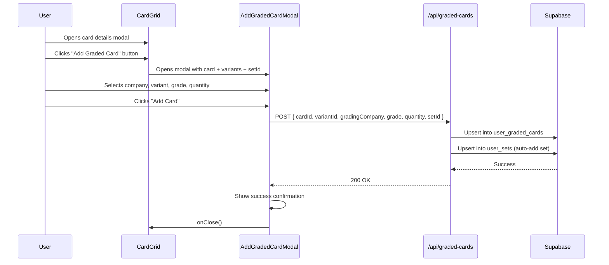

# Graded Cards Collection Feature

## Overview

Allow users to add graded copies of cards to their collection. A graded card is a regular card that has been submitted to a third-party grading company (PSA, Beckett, CGC, TAG, ACE) and returned in a sealed case with an official grade label. These are tracked separately from regular card variants in a new `user_graded_cards` table.

## Entry Point

In the **Card Details Modal** → **Card tab** → below all variant rows, above the "🔥 Missing a variant?" button, add a new **"🏅 Add Graded Card"** button. Clicking it opens the `AddGradedCardModal`.

---

## Data Model

### New Table: `user_graded_cards`

```sql
CREATE TABLE IF NOT EXISTS public.user_graded_cards (
  id               uuid        PRIMARY KEY DEFAULT gen_random_uuid(),
  user_id          uuid        NOT NULL REFERENCES public.users(id) ON DELETE CASCADE,
  card_id          uuid        NOT NULL REFERENCES public.cards(id) ON DELETE CASCADE,
  variant_id       uuid        REFERENCES public.variants(id) ON DELETE SET NULL,
  grading_company  text        NOT NULL
                     CHECK (grading_company IN ('PSA', 'BECKETT', 'CGC', 'TAG', 'ACE')),
  grade            text        NOT NULL,   -- e.g. "GEM-MT 10", "Black Label 10"
  quantity         integer     NOT NULL DEFAULT 1 CHECK (quantity >= 0),
  created_at       timestamptz NOT NULL DEFAULT now(),
  updated_at       timestamptz NOT NULL DEFAULT now(),
  CONSTRAINT user_graded_cards_unique
    UNIQUE (user_id, card_id, variant_id, grading_company, grade)
);
```

- **No numeric grade column** — grade is stored as the company-specific label text (e.g. `"GEM-MT 10"`, `"Black Label 10"`, `"Pristine 10"`) to handle all edge cases.
- The **sort order** for grades is defined in code constants, not in the DB.
- **`quantity = 0`** rows are deleted rather than kept (consistent with `user_card_variants` behaviour).
- RLS policies: owner read/write, public can read only when the owner profile is public (future), admins can do anything.

---

## Grade Constants (TypeScript)

Defined in `types/index.ts`:

```ts
export const GRADING_COMPANIES = ['PSA', 'BECKETT', 'CGC', 'TAG', 'ACE'] as const
export type GradingCompany = typeof GRADING_COMPANIES[number]

export const GRADES_BY_COMPANY: Record<GradingCompany, string[]> = {
  PSA: [
    'VG-EX 4', 'EX 5', 'EX-MT 6', 'NM 7', 'NM+ 7.5',
    'NM-MT 8', 'NM-MT+ 8.5', 'MINT 9', 'GEM-MT 10',
  ],
  BECKETT: [
    'EX-MT+ 6.5', 'Near Mint 7', 'Near Mint+ 7.5', 'NM-MT 8',
    'NM-MT+ 8.5', 'Mint 9', 'Gem Mint 9.5', 'Pristine 10', 'Black Label 10',
  ],
  CGC: [
    'Ex/MT+ 6.5', 'NM 7', 'NM+ 7.5', 'NM/Mint 8', 'NM/Mint+ 8.5',
    'Mint 9', 'Mint+ 9.5', 'Gem Mint 10', 'Pristine 10',
  ],
  TAG: [
    'EX MT 6', 'EX MT+ 6.5', 'NM 7', 'NM+ 7.5', 'NM MT 8',
    'NM MT+ 8.5', 'MINT 9', 'Pristine 10', 'GEM MINT 10',
  ],
  ACE: [
    'FAIR 2', 'GOOD 3', 'VG 4', 'EX 5', 'EX-MT 6',
    'NM 7', 'NM-MT 8', 'MINT 9', 'GEM MINT 10',
  ],
}

export interface UserGradedCard {
  id: string
  user_id: string
  card_id: string
  variant_id: string | null
  grading_company: GradingCompany
  grade: string
  quantity: number
  created_at: string
  updated_at: string
}
```

---

## API

### `GET /api/graded-cards?cardId=<uuid>`

Returns all graded cards for the authenticated user for a given `cardId`.

**Response:**
```json
[
  {
    "id": "...",
    "card_id": "...",
    "variant_id": "...",
    "grading_company": "PSA",
    "grade": "GEM-MT 10",
    "quantity": 1
  }
]
```

### `POST /api/graded-cards`

Upserts (add or update quantity) a graded card for the authenticated user. If `quantity` reaches 0, the row is deleted.

**Request body:**
```json
{
  "cardId": "...",
  "variantId": "...",
  "gradingCompany": "PSA",
  "grade": "GEM-MT 10",
  "quantity": 1,
  "setId": "..."
}
```

The `setId` is forwarded to auto-add the set to `user_sets` on the first card added (matching existing `upsertUserCardVariant` behaviour).

---

## Component: `AddGradedCardModal`

**File:** `components/AddGradedCardModal.tsx`

### Props

```ts
interface AddGradedCardModalProps {
  isOpen: boolean
  onClose: () => void
  card: PokemonCard
  setName?: string | null
  setComplete?: number | null
  setTotal?: number
  setId: string
  variants: VariantWithQuantity[]   // already loaded filteredVariants from CardGrid
  userId: string
}
```

### Layout (matches the mockup)

```
┌─────────────────────────────────────────────┐
│ Add Graded Card                          ✕  │
├─────────────────────────────────────────────┤
│ [card img]  Card Name  •  Set Name          │
│             Set Name  •  Number             │
│             N/A  (or last graded value)     │
├─────────────────────────────────────────────┤
│  [PSA] [BECKETT] [CGC] [TAG] [ACE]          │
├─────────────────────────────────────────────┤
│  Variant         │  Condition               │
│  [dropdown ▼]   │  [dropdown ▼]            │
├─────────────────────────────────────────────┤
│  Quantity                                   │
│  [    1    ]                                │
├─────────────────────────────────────────────┤
│  [        Add Card        ]                 │
└─────────────────────────────────────────────┘
```

### Behaviour

1. **Company selector** — styled logo/text pills, one selected at a time (default: PSA). Selecting a different company resets the Grade dropdown to the first grade for that company.
2. **Variant dropdown** — pre-populated with the card's `filteredVariants`. Defaults to the card's default variant (or first in list).
3. **Grade dropdown** — shows the `GRADES_BY_COMPANY[selectedCompany]` list. Defaults to the last/highest grade (index `length - 1`).
4. **Quantity** — number input, min 1, default 1.
5. **"Add Card" button** — calls `POST /api/graded-cards`, shows loading state, closes modal on success and shows a brief success toast (or inline confirmation).
6. The modal uses the existing `components/ui/Modal.tsx` wrapper.

---

## CardGrid Changes

In `components/CardGrid.tsx`:

1. Add state: `const [showGradedModal, setShowGradedModal] = useState(false)`
2. Import `AddGradedCardModal`.
3. Inside the Card tab, between the variant rows section and the "Missing a variant?" button, insert:

```tsx
{/* Add Graded Card */}
{user && (
  <div className="border-t border-subtle pt-3 mt-2">
    <button
      onClick={() => setShowGradedModal(true)}
      className="w-full py-2.5 px-4 bg-elevated hover:bg-card-item border border-subtle text-primary rounded-lg transition-colors font-medium text-sm flex items-center justify-center gap-2"
    >
      🏅 Add Graded Card
    </button>
  </div>
)}
```

4. Render `AddGradedCardModal` below the main `Modal`:

```tsx
{selectedCard && user && (
  <AddGradedCardModal
    isOpen={showGradedModal}
    onClose={() => setShowGradedModal(false)}
    card={selectedCard}
    setName={setName}
    setComplete={setComplete}
    setTotal={setTotal}
    setId={/* setId prop */}
    variants={filteredVariants}
    userId={user.id}
  />
)}
```

5. Reset `showGradedModal` to `false` when `selectedCard` changes (to prevent stale open state).

---

## File Summary

| File | Action |
|------|--------|
| `database/migration_user_graded_cards.sql` | **CREATE** — new table, RLS policies |
| `types/index.ts` | **MODIFY** — add `GRADING_COMPANIES`, `GradingCompany`, `GRADES_BY_COMPANY`, `UserGradedCard` |
| `lib/userCards.ts` | **MODIFY** — add `getUserGradedCards()`, `upsertUserGradedCard()` |
| `app/api/graded-cards/route.ts` | **CREATE** — GET + POST handlers |
| `components/AddGradedCardModal.tsx` | **CREATE** — full modal UI |
| `components/CardGrid.tsx` | **MODIFY** — button + modal state wiring |

---

## Flow Diagram



---

## Out of Scope (Future Work)

- Displaying graded cards on the collection page / set page cards grid
- Graded card count badges on `CardTile`
- Graded card portfolio value calculation
- Editing / removing graded cards (can be added later with a manage graded cards view)
- Public profile visibility for graded cards
