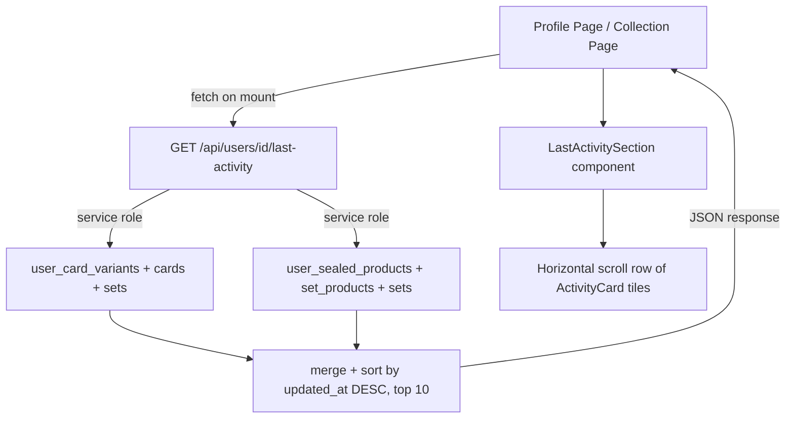

# Last Activity Section — Profile & Collection Pages

## Overview

Add a **"Last Activity"** section to both the Profile page (`app/profile/[id]/page.tsx`) and the Collection page (`app/collection/page.tsx`) that shows the user's 10 most recently added or updated **card variants** and **sealed products** in reverse-chronological order.

---

## Data Sources

| Table | Timestamp column | Joined display data |
|---|---|---|
| `user_card_variants` | `updated_at` | `cards` (name, number, image, type, set_id) → `sets` (name, logo_url) |
| `user_sealed_products` | `updated_at` | `set_products` (name, product_type, image_url) → `sets` (name) |

Both tables have RLS policies restricting selection to `auth.uid() = user_id`, so cross-user access on the Profile page requires the **service-role Supabase client** (`supabaseAdmin`) via a server-side API route.

---

## Architecture



---

## 1. DB Migration — Performance Indexes

**File:** `database/migration_last_activity_indexes.sql`

```sql
-- Speeds up "last N activity items" queries ordered by updated_at DESC
CREATE INDEX IF NOT EXISTS ucv_user_id_updated_at_idx
  ON public.user_card_variants (user_id, updated_at DESC);

CREATE INDEX IF NOT EXISTS usp_user_id_updated_at_idx
  ON public.user_sealed_products (user_id, updated_at DESC);
```

Run once in the Supabase SQL editor.

---

## 2. API Route — `GET /api/users/[id]/last-activity`

**File:** `app/api/users/[id]/last-activity/route.ts`

### Logic

1. Read `params.id` (the target user's UUID).
2. Fetch the user row to check `profile_private`. If `true` and the requester is not the owner, return `{ data: [] }`.
3. In parallel, fetch:
   - **Cards:** Last 10 `user_card_variants` rows for this user, joining `cards` (name, number, image, type, set_id) and then `sets` (name, logo_url), ordered by `updated_at DESC`, limit 10.
   - **Products:** Last 5 `user_sealed_products` rows for this user, joining `set_products` (name, product_type, image_url, set_id) and then `sets` (name), ordered by `updated_at DESC`, limit 5.
4. Normalise each into a shared `ActivityItem` shape.
5. Merge arrays, sort by `timestamp DESC`, return first 10.

### Response Shape

```typescript
type ActivityItem =
  | {
      type: 'card'
      timestamp: string         // ISO 8601 (updated_at)
      card_id: string
      card_name: string
      card_number: string
      card_image: string | null
      card_type: string | null
      variant_type: string | null  // e.g. "normal", "reverse"
      set_id: string
      set_name: string
    }
  | {
      type: 'sealed_product'
      timestamp: string
      product_id: string
      product_name: string
      product_type: string | null  // e.g. "Booster Box", "ETB"
      product_image: string | null
      quantity: number
      set_id: string
      set_name: string
    }
```

---

## 3. Component — `LastActivitySection`

**File:** `components/profile/LastActivitySection.tsx`

### Props

```typescript
interface LastActivitySectionProps {
  userId: string
  isOwnProfile: boolean
  /** Pass true on the Collection page (no heading needed there) */
  compact?: boolean
}
```

### States

- **Loading:** Renders a horizontal row of `~5` skeleton card-shaped rectangles.
- **Empty:** Shows a small `"No recent activity yet"` pill/message — only shown on own profile; hidden when viewing a public profile with no activity.
- **Populated:** Horizontal scrollable row (`flex overflow-x-auto gap-3 pb-2`) of `ActivityCard` tiles.

### `ActivityCard` tile (inline sub-component)

Each tile is a clickable `<Link href="/set/[set_id]">` that shows:

- **Card type:** `<CardImage>` thumbnail (the existing `CardImage` component), ~80px wide, with the variant badge colour overlaid.
- **Sealed product type:** Product `image_url` (or a fallback box emoji `📦`), same size.
- Bottom strip:
  - Card/product name (truncated, 1 line)
  - Set name (truncated, muted text)
  - Relative timestamp (`"2h ago"`, `"3 days ago"`) formatted with a simple helper.

### Relative timestamp helper

```typescript
function timeAgo(iso: string): string {
  const diff = Date.now() - new Date(iso).getTime()
  const mins = Math.floor(diff / 60_000)
  if (mins < 60)   return `${mins}m ago`
  const hrs = Math.floor(mins / 60)
  if (hrs < 24)    return `${hrs}h ago`
  const days = Math.floor(hrs / 24)
  if (days < 30)   return `${days}d ago`
  const months = Math.floor(days / 30)
  return `${months}mo ago`
}
```

---

## 4. Profile Page Integration

**File:** `app/profile/[id]/page.tsx`

Insert `<LastActivitySection>` **after the Stats Row** (line ~681) and **before the Achievements section** (line ~697):

```tsx
{/* ── Last Activity ─────────────────────────────────────────── */}
<LastActivitySection userId={userId} isOwnProfile={isOwnProfile} />

{/* ── Achievements Section ──────────────────────────────────── */}
<section className="mb-8">
  ...
```

No new state is required — `LastActivitySection` fetches its own data internally.

---

## 5. Collection Page Integration

**File:** `app/collection/page.tsx`

Insert `<LastActivitySection>` **after the Summary Stats block** (after line ~157) and **before the Search/Filter input** (line ~159):

```tsx
{/* ── Last Activity ───────────────────────────────────────── */}
<LastActivitySection userId={user.id} isOwnProfile={true} compact />

{/* ── Search / Filter ──────────────────────────────────────── */}
<div className="mb-6">
  ...
```

On the Collection page `isOwnProfile` is always `true` (the page redirects unauthenticated users to `/login`), so `user.id` is always available.

---

## Visual Layout Sketch

```
Last Activity
┌─────────────────────────────────────────────────────┐
│ [card img] [card img] [card img] [card img] [📦 box] │  ← horizontally scrollable
│  Pikachu    Charizard  Mewtwo    Bulbasaur  ETB      │
│  Base Set   Base Set   Jungle    Base Set   SV Prom. │
│  2h ago     1d ago     3d ago    5d ago     1wk ago  │
└─────────────────────────────────────────────────────┘
```

---

## Files Changed / Created

| Action | Path |
|--------|------|
| **Create** | `database/migration_last_activity_indexes.sql` |
| **Create** | `app/api/users/[id]/last-activity/route.ts` |
| **Create** | `components/profile/LastActivitySection.tsx` |
| **Modify** | `app/profile/[id]/page.tsx` — add import + component |
| **Modify** | `app/collection/page.tsx` — add import + component |
