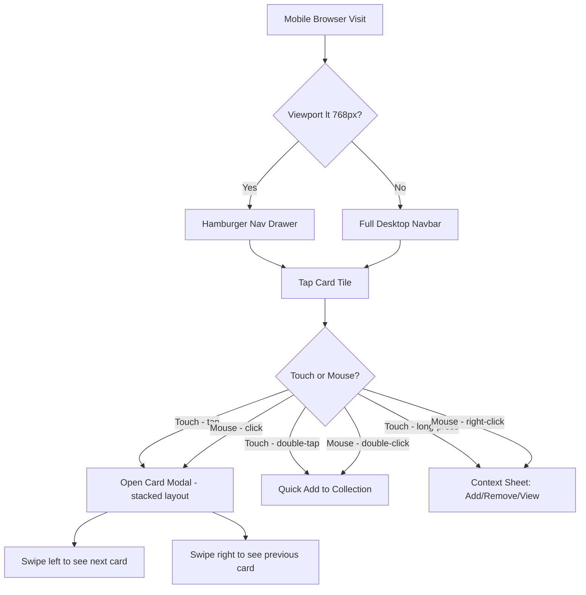

# Lumidex — Mobile Browser Responsiveness Plan

> **Status:** Assessment completed May 2026  
> **Stack:** Next.js 16 · Tailwind CSS v4 · React 19 · Headless UI v2  
> **Target devices:** iPhone SE 2nd gen (375px), standard phones (390–430px), tablets (768–1024px)

---

## 1. Executive Summary

Lumidex was built desktop-first. The majority of layout, typography, and interaction assumptions target screens ≥ 1024 px. Most components have *some* Tailwind responsive prefixes (`sm:`, `md:`), but several core interactive surfaces — the **Navbar**, the **card detail modal**, and the **card grid tiles** — will break or be unusable on a 375–430 px viewport.

**What is already working well:**
- [`Footer.tsx`](components/Footer.tsx) — `flex-col sm:flex-row` stacking, wraps cleanly
- [`DashboardHero.tsx`](components/dashboard/DashboardHero.tsx) — `flex-col sm:flex-row`, text scales with `text-2xl sm:text-3xl`
- [`DashboardStats.tsx`](components/dashboard/DashboardStats.tsx) — `grid-cols-2 md:grid-cols-4`, renders as 2-up on mobile
- [`QuickActions.tsx`](components/dashboard/QuickActions.tsx) — `overflow-x-auto` horizontal scroll row, already mobile-friendly
- [`WantedBoardPage`](app/wanted-board/page.tsx) — hero uses `px-4 sm:px-6`, `flex-col sm:flex-row`
- [`BrowseHero.tsx`](components/browse/BrowseHero.tsx) — search bar is `max-w-2xl mx-auto`, mode tabs wrap with `justify-center gap-2`
- Global CSS — `min-h: 100dvh`, `img { max-width: 100% }`, `box-sizing: border-box`

**What is broken / missing:**
- Navigation has no hamburger/collapse mechanism — 7 inline links + search + notification bell + user section all cram into a 56px-high bar
- Card tiles have a **hardcoded 220 px width** — they never flex below that
- The card detail modal uses an **un-stacked two-column flex** — the card image and detail panel are side-by-side with no `flex-col` breakpoint
- Double-click (add to collection) and right-click (decrement) interactions have no touch equivalents
- `autoFocus` on the Browse page search causes the iOS/Android virtual keyboard to pop immediately, pushing content up
- No PWA `<meta name="viewport">` is declared explicitly (Next.js injects a default, but `theme-color` and `apple-mobile-web-app-capable` are absent)
- Hover-only CSS card-type glows have no touch tap equivalent
- The notification dropdown is hardcoded `w-80` — overflows a 375 px screen by ~25 px

---

## 2. Severity Classification

### 🔴 Critical — Breaks usability on mobile

| # | Component / Area | Issue |
|---|-----------------|-------|
| C1 | [`Navbar.tsx`](components/Navbar.tsx) | No hamburger menu; 7 nav links + search + bell + user avatar all inline — completely overflows on phones |
| C2 | [`CardTile.tsx`](components/CardTile.tsx) | `style={{ width: 220 }}` hardcoded pixel width; card grid renders only 1 card per row but at a fixed size that doesn't fill the viewport |
| C3 | [`CardGrid.tsx`](components/CardGrid.tsx) — modal | `flex gap-6` two-column layout (image left, details right) has no `flex-col` stacking; on mobile the image is squashed and detail panel is invisible without horizontal scroll |
| C4 | Touch interactions (CardGrid) | Double-click = quick-add, right-click = decrement — neither gesture exists reliably on touch; users would have no way to add/remove cards on mobile |
| C5 | [`Navbar.tsx`](components/Navbar.tsx) notification dropdown | `w-80` (320 px) dropdown right-aligned — overflows left edge on 375 px screen |

---

### 🟠 High — Significantly degrades experience

| # | Component / Area | Issue |
|---|-----------------|-------|
| H1 | [`SetPageCards.tsx`](components/SetPageCards.tsx) — stats strip | `flex items-center gap-8 flex-wrap` — 5 stat chips wrap unpredictably; the `ml-auto` Binder Guide / Missing Card cluster detaches visually |
| H2 | [`SetPageCards.tsx`](components/SetPageCards.tsx) — search + toolbar | Search input has `w-52` fixed width; the entire toolbar row is `flex-wrap` but not mobile-considered |
| H3 | [`BrowseFilters.tsx`](components/browse/BrowseFilters.tsx) | Filter buttons are `h-7` (28 px) — well below the recommended 44 px touch target minimum |
| H4 | [`BrowseHero.tsx`](components/browse/BrowseHero.tsx) | `autoFocus` on the search input triggers the iOS/Android virtual keyboard as soon as the browse page loads, hiding most of the UI |
| H5 | [`CardTile.tsx`](components/CardTile.tsx) — variant dots | Variant dot buttons are tiny (≈ 10 px circles) — untappable on touch without enlargement |
| H6 | [`SetPageCards.tsx`](components/SetPageCards.tsx) — Collection Goal + Variant Legend row | `flex flex-wrap items-start gap-6` + `ml-auto` — the right-side buttons detach below on narrow screens with no clear visual grouping |
| H7 | [`CollectionOnboardingModal.tsx`](components/onboarding/CollectionOnboardingModal.tsx) — onboarding copy | Mentions "right-click" and "double-click" — meaningless and confusing on touch devices |

---

### 🟡 Medium — Noticeable friction, not blocking

| # | Component / Area | Issue |
|---|-----------------|-------|
| M1 | [`app/layout.tsx`](app/layout.tsx) — `<head>` | No explicit viewport meta, no `theme-color`, no `apple-mobile-web-app-*` tags, no PWA manifest link |
| M2 | [`globals.css`](app/globals.css) | Card type hover glows use `:hover` pseudo-class only — no touch-tap feedback equivalent |
| M3 | [`SetCard.tsx`](components/SetCard.tsx) | Favorite button `p-1.5` with `w-4 h-4` icon = ~28 px hit target, below 44 px minimum |
| M4 | Navbar notification bell button | `p-2` gives ~40 px hit area — marginally below recommended minimum |
| M5 | [`ArtistDetailClient.tsx`](components/ArtistDetailClient.tsx) | No explicit responsive grid for the card gallery — relies on implicit flex wrapping |
| M6 | [`SetPageCards.tsx`](components/SetPageCards.tsx) — filter tabs | Tab bar `px-4 py-2.5` buttons are fine, but 4 tabs (`All`, `Owned`, `Missing`, `Duplicates`) could overflow on very small screens |
| M7 | [`BrowseClient.tsx`](components/browse/BrowseClient.tsx) | Artist-view header uses `px-6` horizontal padding which is generous, but 375 px feels cramped |
| M8 | Sign-out button in Navbar | `px-3 py-1.5 text-xs` = ~32 px height, too small for easy tapping |
| M9 | Price chart ([`PriceChart.tsx`](components/PriceChart.tsx) via Recharts) | Recharts needs `width="100%"` + ResponsiveContainer to adapt to mobile width |

---

### 🟢 Low — Polish items

| # | Component / Area | Issue |
|---|-----------------|-------|
| L1 | [`globals.css`](app/globals.css) | Custom scrollbar styling removes native momentum scroll feel on iOS |
| L2 | All pages | No `loading.tsx` skeleton for the main content area on mobile (only Browse/Collection/Dashboard have them) |
| L3 | Hover transitions | `group-hover:scale-105` on set logos / artist cards never fires on touch — could be replaced with `active:scale-95` tap feedback |
| L4 | [`Navbar.tsx`](components/Navbar.tsx) | Username hidden on mobile (`hidden sm:block`) — user has no way to know which account is active on mobile |
| L5 | [`next.config.js`](next.config.js) | `deviceSizes: [640, 1080, 1920]` — 390/430 px common phone widths are served the 640 px image; acceptable but wasteful |

---

## 3. Detailed Fix Specifications

### C1 — Navbar: Add hamburger menu

**Current state:** [`components/Navbar.tsx`](components/Navbar.tsx:181) renders all nav elements inline in a single `flex` row.

**Fix:**
```
Navbar layout change:
  - Keep Logo + Search (narrow, max-w-[160px] on mobile) + Bell + Avatar on mobile bar
  - Hide all <Link> nav items + Sign-out behind a hamburger button on screens < lg
  - Add <HamburgerButton> (3-line icon, ≥ 44px tap target) at the right
  - Add a <MobileDrawer> or slide-down panel (full-width, z-50) for nav links when open
  - Close drawer on route change (usePathname effect)
  - Move Sign-out to bottom of mobile drawer
  - Upgrade button: show as prominent full-width CTA inside drawer
  - Notification bell: keep visible always (ensure dropdown is max-w-[calc(100vw-2rem)] positioned)
```

**Tailwind approach:**
- Wrap nav links: `hidden lg:flex items-center gap-1`
- Hamburger button: `flex lg:hidden`
- Mobile drawer: `fixed inset-0 z-40 lg:hidden` overlay + panel

---

### C2 — CardTile: Responsive card width

**Current state:** [`components/CardTile.tsx`](components/CardTile.tsx:98) — `style={{ width: 220 }}` and `className="w-[220px] h-[308px]"`.

**Fix:**
```
Replace the fixed-width card tile with a responsive width:
  - Remove style={{ width: 220 }}
  - Change the card grid container in CardGrid from:
      <div className="flex flex-wrap gap-4">
    to a CSS grid:
      <div className="grid gap-3 grid-cols-2 sm:grid-cols-3 md:grid-cols-4 lg:grid-cols-5 xl:grid-cols-6 2xl:grid-cols-8">
  - CardTile: replace w-[220px] h-[308px] with w-full aspect-[5/7]
  - The image area: replace w-[220px] h-[308px] with w-full h-full
  - Variant dots row below: ensure min-h-[44px] touch target area or group into a tappable row
```

---

### C3 — Card Detail Modal: Stack on mobile

**Current state:** [`components/CardGrid.tsx`](components/CardGrid.tsx:1546) — `<div className="flex gap-6">` for the two-column side-by-side layout.

**Fix:**
```
Change the modal inner layout to stack on mobile:
  - <div className="flex flex-col sm:flex-row gap-4 sm:gap-6">
  - On mobile: card image shown first (full-width, max-h ~50vh with object-contain)
  - On mobile: detail panel scrolls below the image within the modal
  - Modal maxWidth stays 5xl but Modal component should treat small screens as full-screen:
    In Modal.tsx, add sm:rounded-2xl to allow top/bottom flat edges on ≤ sm screens
    Add: <div className="fixed inset-0 sm:relative sm:inset-auto sm:p-4 overflow-y-auto">
  - Close button: ensure ≥ 44px tap target (currently p-2 on the ✕ = OK)
  - Add left/right swipe gesture for card navigation (replaces keyboard arrows)
```

---

### C4 — Touch interactions: Add mobile equivalents

**Current state:** [`components/CardGrid.tsx`](components/CardGrid.tsx:1368) — `onDoubleClick` (quick-add) and `onContextMenu` (right-click decrement) are desktop-only concepts.

**Fix:**
```
CardTile touch interaction additions:
  1. Long-press (300ms) → open the card detail modal (replaces right-click)
     Use a touchstart + setTimeout + touchend/touchmove guard approach
  2. Tap = open modal (current single-click behavior is fine)
  3. Double-tap detection:
     - Track last tap time; if second tap within 300ms on same card → quick-add
     - Or: add a prominent "+ Add" / "- Remove" button visible on the card face
       (shown persistently on touch devices, or on tap of the card)
  4. Variant dots: make them at minimum 28px × 28px with a 44px invisible ::after hit area
     via padding or a transparent hit-area wrapper

Onboarding modal copy fix (C4 & H7):
  - Detect touch device via `'ontouchstart' in window`
  - Swap "double-click" → "double-tap" and "right-click" → "long-press" in displayed text
```

---

### C5 — Navbar notification dropdown overflow

**Current state:** [`components/Navbar.tsx`](components/Navbar.tsx:270) — `w-80` (320 px).

**Fix:**
```
Change: className="absolute right-0 top-full mt-2 w-80 ..."
To:     className="absolute right-0 top-full mt-2 w-80 max-w-[calc(100vw-1rem)] ..."
Add:    right-aligned by default; if near left edge, use left-0 instead
```

---

### H1 + H2 + H6 — SetPageCards toolbar: Mobile-first rework

**Current state:** [`components/SetPageCards.tsx`](components/SetPageCards.tsx:269) — stats strip + variant legend strip use wide `flex gap-8` with fixed-width inputs.

**Fix:**
```
Stats strip:
  - Change to: grid-cols-2 sm:grid-cols-3 md:grid-cols-5 gap-3
  - Each stat as a small card cell (label above, value below)

Collection Goal + Variant Legend + Buttons row:
  - Change to: flex flex-col sm:flex-row flex-wrap gap-4
  - Remove ml-auto from the Binder/Report button cluster; let it flow naturally
  - On mobile, each sub-group stacks on its own row

Search bar (w-52 → responsive):
  - Change w-52 to w-full sm:w-52

Sort pills:
  - No change needed but verify flex-wrap on very small screens
```

---

### H3 — BrowseFilters: Increase touch targets

**Current state:** [`components/browse/BrowseFilters.tsx`](components/browse/BrowseFilters.tsx:61) — `h-7` filter buttons = 28 px.

**Fix:**
```
Change h-7 → h-9 (36px) on all filter pills and selects
Add py-2 to the filter bar container to give breathing room
The select elements: wrap in a larger tap-target container or set min-h-[44px]
```

---

### H4 — BrowseHero: Remove autoFocus on mobile

**Current state:** [`components/browse/BrowseHero.tsx`](components/browse/BrowseHero.tsx:195) — `autoFocus` attribute on the search input.

**Fix:**
```
Detect touch/mobile:
  const isTouchDevice = typeof window !== 'undefined' && 'ontouchstart' in window
  ...
  <input
    autoFocus={!isTouchDevice}
    ...
  />

Or simply remove autoFocus entirely and let users tap to activate the search.
```

---

### H5 — CardTile variant dots: Larger tap targets

**Current state:** [`components/CardTile.tsx`](components/CardTile.tsx:92) — variant dots are tiny `w-3 h-3` circles with small padding.

**Fix:**
```
Each variant dot button: add min-w-[36px] min-h-[36px] flex items-center justify-center
The visible dot circle remains the same size cosmetically but the tappable area grows
Or use a pseudo-element approach: after:absolute after:inset-[-10px] on the button
```

---

### M1 — Layout: Add mobile/PWA meta tags

**Current state:** [`app/layout.tsx`](app/layout.tsx:22) — only title + description in `metadata`.

**Fix:**
```typescript
// app/layout.tsx
export const viewport: Viewport = {
  width: 'device-width',
  initialScale: 1,
  maximumScale: 5,            // don't block user zoom — accessibility requirement
  themeColor: '#0a0a0f',     // matches --color-bg-base
}

// Also add to <head>:
<meta name="apple-mobile-web-app-capable" content="yes" />
<meta name="apple-mobile-web-app-status-bar-style" content="black-translucent" />
<link rel="apple-touch-icon" href="/apple-touch-icon.png" />

// Create public/manifest.json for PWA:
{
  "name": "Lumidex",
  "short_name": "Lumidex",
  "description": "Pokémon TCG Collection Tracker",
  "start_url": "/dashboard",
  "display": "standalone",
  "background_color": "#0a0a0f",
  "theme_color": "#6d5fff",
  "icons": [...]
}
```

---

### M3 — SetCard favorite button: Larger hit area

**Current state:** [`components/SetCard.tsx`](components/SetCard.tsx:88) — `p-1.5` with `w-4 h-4` icon = ~28px tap target.

**Fix:**
```
Change: className="absolute top-2 right-2 z-20 p-1.5 rounded-full ..."
To:     className="absolute top-2 right-2 z-20 p-3 rounded-full ..."  (p-3 = 48px)
```

---

## 4. Global Recommendations

### 4.1 Viewport Meta Tags

Next.js 13+ injects `<meta name="viewport" content="width=device-width, initial-scale=1">` automatically via the App Router when a `viewport` export is present. Add the following to [`app/layout.tsx`](app/layout.tsx):

```typescript
import type { Viewport } from 'next'
export const viewport: Viewport = {
  width: 'device-width',
  initialScale: 1,
  maximumScale: 5,
  themeColor: '#0a0a0f',
}
```

**Important:** Do NOT set `user-scalable=no` or `maximum-scale=1` — this is an accessibility violation and Apple enforces zoom functionality since iOS 10.

### 4.2 Touch Targets (44 px minimum)

All interactive elements (buttons, links, form controls) must meet the WCAG 2.5.5 AAA guideline of 44×44 px minimum touch target. Current violations:

| Element | Current size | Target |
|---------|-------------|--------|
| Variant dot buttons | ~28×28 px | Pad to 44×44 px via wrapper |
| Filter pills in BrowseFilters | 28 px height | `h-11` (44 px) or `min-h-[44px]` |
| Favorite star button (SetCard) | ~28 px | `p-3` gives ~48 px |
| Notification bell | ~40 px | `p-2.5` gives ~44 px |
| Sign-out button | ~32 px | `py-2.5` gives ~44 px |

### 4.3 Scroll Behavior

- **Card grid:** `overflow-x-auto` is already on `QuickActions`. The main card grid should scroll vertically — no changes needed.
- **Mobile drawer (Navbar):** Scrollable nav drawer via `overflow-y-auto max-h-[calc(100vh-56px)]`
- **Card modal on mobile:** `overflow-y-auto` already on `max-h-[90vh]` in `Modal.tsx` — this handles mobile scroll correctly.
- **Horizontal scrollable filter bar:** Consider wrapping `BrowseFilters` in `overflow-x-auto whitespace-nowrap` on mobile, OR stacking the filter pills to two rows.
- **iOS overscroll bounce:** Add `overscroll-behavior-y: contain` on modal overlays to prevent background bounce.

### 4.4 Safe Area Insets (iPhone notch / Dynamic Island)

For phones with a notch, Dynamic Island, or home indicator, add safe area padding:

```css
/* app/globals.css — add to @layer base */
body {
  padding-env: env(safe-area-inset-bottom);
}

/* Navbar sticky top gets safe-area-inset-top automatically via the browser */
```

For the mobile Navbar bottom drawer append:
```
pb-[env(safe-area-inset-bottom)]
```

---

## 5. Touch Gesture Considerations

### 5.1 Swipe Navigation in Card Modal 

Replace keyboard-only arrow navigation with touch swipe:

```typescript
// Simple touch swipe hook approach in CardGrid modal
const touchStartX = useRef<number>(0)
const handleTouchStart = (e: React.TouchEvent) => {
  touchStartX.current = e.touches[0].clientX
}
const handleTouchEnd = (e: React.TouchEvent) => {
  const delta = e.changedTouches[0].clientX - touchStartX.current
  if (Math.abs(delta) > 50) navigateCard(delta < 0 ? 1 : -1)
}
```

Attach `onTouchStart` / `onTouchEnd` to the modal content container.

### 5.2 Long-Press for Context Actions

The card double-click (quick-add) and right-click (decrement) have no mobile equivalent. Two approaches:

**Option A — Contextual overlay on tap:**
When a user taps a card tile (instead of immediately opening the modal), show a brief overlay with `+ Add`, `- Remove`, `View` buttons for 1.5s. A second tap on the same card opens the modal.

**Option B — Long-press gesture:**
After 400ms hold on a card, show a bottom sheet with quick actions (Add, Remove, View Card Detail). Clear on touch end if the hold was shorter.

**Recommendation:** Option A is simpler to implement and more discoverable.

### 5.3 Pull-to-Refresh

Not currently implemented. Low priority but nice-to-have for the collection and wanted-board pages where data polling is already in place.

### 5.4 Tap Feedback

Replace `hover:scale-105` transforms (which never fire on touch) with `active:scale-95` for immediate tap feedback on:
- `SetCard.tsx` — `group-hover:scale-105` on the set logo
- `CardTile.tsx` — the card image wrapper
- `ArtistDetailClient.tsx` — the card tile images

---

## 6. Performance Considerations for Mobile

### 6.1 Image Optimization

| Issue | Fix |
|-------|-----|
| Many `` tags bypass Next.js image pipeline | Convert high-traffic images (card thumbnails, set logos) to `<Image>` with appropriate `sizes` prop |
| `next.config.js` `deviceSizes: [640, 1080, 1920]` — 390px phones get 640px images | Add `390` to `deviceSizes` or use `sizes="(max-width: 640px) 100vw, ..."` on `<Image>` components |
| `CardTile` images load eagerly for all visible cards | Already using standard `loading="lazy"` on many images; preserve this |
| Set logo blur background in `SetCard` duplicates image request | Already mitigated by CSS background-image re-use comment in code |

### 6.2 JavaScript Bundle on Mobile

- `CardGrid.tsx` is 2,472 lines — a large client component. Consider splitting the card detail modal into a separate dynamic import:
  ```typescript
  const CardDetailModal = dynamic(() => import('./CardDetailModal'), { ssr: false })
  ```
- `PriceChart` already uses `dynamic(() => import(...), { ssr: false })` — good.
- Recharts adds ~180 KB gzipped. On mobile/3G this is noticeable. Consider conditionally loading only when the Price tab is opened.

### 6.3 Font Loading

Both Inter and Space Grotesk use `display: 'swap'` — good for mobile LCP. No changes needed.

### 6.4 Scroll Performance

The card grid of 200+ `CardTile` components with hover effects may cause jank on low-end Android devices. Consider:
- `will-change: transform` on card tiles that have CSS transforms
- Virtual scrolling for very large sets (50+ cards) — low priority

### 6.5 API Polling on Mobile

`Navbar.tsx` polls `/api/friendships` and `/api/trade-proposals` every 60 seconds. On mobile browsers, this runs in the background but pauses when the tab is hidden. Consider using `document.visibilityState` to pause polling when the page is hidden:
```typescript
useEffect(() => {
  const handleVisibility = () => {
    if (document.hidden) clearInterval(pollId)
    else pollId = setInterval(load, 60_000)
  }
  document.addEventListener('visibilitychange', handleVisibility)
}, [])
```

---

## 7. Path to Native iOS/Android Apps

### 7.1 Option A: Capacitor.js (Recommended)

Wrap the existing Next.js PWA in [Capacitor](https://capacitorjs.com/) to produce native iOS and Android binaries from the same codebase.

**Pros:**
- Reuses 100% of existing Next.js + Tailwind code
- Access to native APIs (camera for card scanning, haptic feedback, push notifications, biometric auth)
- App Store / Play Store distribution
- Single codebase to maintain
- Works well with Next.js static exports or a hosted server target
- Capacitor plugins for haptics, local notifications, share sheets

**Cons:**
- Not a "true native" UI — looks/feels like a web app inside a WebView
- Next.js server-side features (SSR, API routes) need a hosted server — Capacitor bundles only static assets locally; API calls go over the network
- App review process required for each release
- Some advanced animations may be janky in WKWebView vs Chrome
- Initial setup adds complexity (Xcode/Android Studio required)

**Implementation path:**
1. First complete the mobile browser responsive fixes (Sections 3–5)
2. Add PWA manifest + service worker (offline card browsing)
3. Export static app shell or point Capacitor to the production URL
4. Configure Capacitor iOS + Android targets
5. Add native plugins: `@capacitor/haptics`, `@capacitor/push-notifications`
6. Submit to App Store / Play Store

---

### 7.2 Option B: React Native (via Expo)

Rewrite the UI layer in React Native, sharing only business logic, API calls, and Zustand store with the web app.

**Pros:**
- True native UI components (iOS UIKit / Android Material)
- Best possible performance and native feel
- Full native gesture system (React Native Gesture Handler)
- Ideal for features like card camera scanning (React Native Vision Camera)

**Cons:**
- Significant rewrite of all UI components (Tailwind CSS → StyleSheet / NativeWind)
- Two separate UI codebases to maintain (web + native)
- Next.js routing, server components, and API routes don't translate
- Longer time to launch
- Higher ongoing maintenance cost

**Recommendation:** Start with Capacitor (Option A). If the app gains significant traction and budget allows, migrate high-traffic screens (set browsing, card adding) to a React Native app while keeping the web version for power users.

---

## 8. Prioritized Implementation Roadmap

### Sprint 1 — Critical Fixes (Mobile Usable)

```
[ ] C1: Navbar hamburger menu + mobile drawer
[ ] C3: Card detail modal — stack image/details on mobile (flex-col sm:flex-row)
[ ] C4: Touch interaction equivalents (double-tap quick-add, long-press open)
[ ] C5: Notification dropdown — max-w-[calc(100vw-1rem)]
[ ] M1: Add viewport meta + PWA meta tags to layout.tsx
```

### Sprint 2 — High Priority Polish

```
[ ] C2: CardTile responsive width (CSS grid approach)
[ ] H3: BrowseFilters touch targets — h-9 minimum
[ ] H4: Remove autoFocus on BrowseHero search on touch devices
[ ] H5: Variant dots — 44px tap target wrappers
[ ] H1+H2+H6: SetPageCards toolbar mobile layout
[ ] H7: Onboarding modal — touch-aware copy
```

### Sprint 3 — Medium & Performance

```
[ ] M2: Add active: tap feedback to replace hover glows
[ ] M3: SetCard favorite button — larger tap area
[ ] M9: PriceChart — verify ResponsiveContainer width behaviour
[ ] Lazy-load CardDetailModal (dynamic import)
[ ] Pause API polling on hidden tabs (Navbar)
[ ] Add safe-area-inset padding for notch/home-indicator
```

### Sprint 4 — PWA & Native App Prep

```
[ ] Create public/manifest.json with icons + splash screens
[ ] Add service worker for offline card browsing (workbox)
[ ] Add apple-touch-icon assets
[ ] Evaluate Capacitor.js integration
[ ] Touch swipe gesture for card modal navigation
```

---

## 9. Mermaid Architecture Diagram



---

## 10. Quick-Reference Fix Summary

| File | Change | Priority |
|------|--------|----------|
| [`components/Navbar.tsx`](components/Navbar.tsx) | Add hamburger + mobile drawer, hide nav links on `< lg` | 🔴 C1 |
| [`components/CardGrid.tsx`](components/CardGrid.tsx:1546) | Modal: `flex-col sm:flex-row`, swipe gesture | 🔴 C3 |
| [`components/CardGrid.tsx`](components/CardGrid.tsx:1462) | Grid: Change to CSS grid, responsive columns | 🔴 C2 |
| [`components/CardGrid.tsx`](components/CardGrid.tsx:1368) | Add double-tap + long-press touch handlers | 🔴 C4 |
| [`components/CardTile.tsx`](components/CardTile.tsx:98) | Remove `style={{ width: 220 }}`, use `w-full aspect-[5/7]` | 🔴 C2 |
| [`components/CardTile.tsx`](components/CardTile.tsx:92) | Variant dots: min 44px tap targets | 🟠 H5 |
| [`components/Navbar.tsx`](components/Navbar.tsx:270) | Notification dropdown: `max-w-[calc(100vw-1rem)]` | 🔴 C5 |
| [`components/browse/BrowseFilters.tsx`](components/browse/BrowseFilters.tsx:61) | `h-7` → `h-9` or `min-h-[44px]` on all pills | 🟠 H3 |
| [`components/browse/BrowseHero.tsx`](components/browse/BrowseHero.tsx:195) | Remove `autoFocus` on touch devices | 🟠 H4 |
| [`components/SetPageCards.tsx`](components/SetPageCards.tsx:269) | Responsive stats / toolbar / search | 🟠 H1/H2/H6 |
| [`components/SetCard.tsx`](components/SetCard.tsx:88) | Favorite button: `p-3` for 48px hit area | 🟡 M3 |
| [`components/onboarding/CollectionOnboardingModal.tsx`](components/onboarding/CollectionOnboardingModal.tsx) | Touch-aware interaction copy | 🟠 H7 |
| [`app/layout.tsx`](app/layout.tsx:22) | Add `viewport` export, PWA meta tags | 🟡 M1 |
| [`app/globals.css`](app/globals.css) | `active:` tap feedback, `overscroll-behavior: contain` | 🟡 M2 |

---

## Sprint 4 — PWA Foundation (Complete)

### What was implemented

| File | Description |
|------|-------------|
| [`public/manifest.json`](public/manifest.json) | Full Web App Manifest — name, short_name, description, start_url `/`, display `standalone`, theme/background colors, portrait orientation, icon references, app shortcuts to `/collection` and `/browse`, categories |
| [`public/icons/icon-192.svg`](public/icons/icon-192.svg) | 192×192 SVG placeholder icon (dark circle + "L" in indigo) |
| [`public/icons/icon-512.svg`](public/icons/icon-512.svg) | 512×512 SVG placeholder icon (same style) |
| [`public/icons/apple-touch-icon.svg`](public/icons/apple-touch-icon.svg) | 180×180 SVG placeholder with rounded-rect background for iOS home screen |
| [`public/sw.js`](public/sw.js) | Production-quality service worker — cache-first for `/_next/static/`, network-first for pages and `/api/`, pre-caches `/` and `/offline` on install, cleans stale caches on activate |
| [`app/offline/page.tsx`](app/offline/page.tsx) | Offline fallback page served when the network is unavailable — "You're offline" message with a reload button |
| [`components/PwaRegister.tsx`](components/PwaRegister.tsx) | `'use client'` component that registers `/sw.js` on mount via `navigator.serviceWorker.register` |
| [`app/layout.tsx`](app/layout.tsx) | Added `<link rel="manifest">`, `<meta name="theme-color">`, Apple meta tags, `<link rel="apple-touch-icon">`, and `<PwaRegister />` just before `</body>` |

### ⚠️ Production checklist before shipping

- **Replace SVG icon placeholders with real PNGs.** Browsers require `.png` format for PWA homescreen icons.
  - `public/icons/icon-192.png` — 192×192 PNG
  - `public/icons/icon-512.png` — 512×512 PNG
  - `public/icons/apple-touch-icon.png` — 180×180 PNG (update the `<link rel="apple-touch-icon">` href in `app/layout.tsx` to point to the `.png`)
  - Update `manifest.json` icon `src` values from `.png` (already correct) — just ensure the physical `.png` files exist at those paths.
- Run Lighthouse PWA audit (`chrome://inspect` or DevTools → Lighthouse tab) and verify the installability checklist passes.
- Test "Add to Home Screen" on both iOS Safari and Android Chrome before App Store / Play Store submission.

### Path to Capacitor (iOS/Android native app)

Once the PWA is verified working in mobile browsers, wrapping the app in Capacitor for iOS/Android is straightforward:

```bash
npm install @capacitor/core @capacitor/cli @capacitor/ios @capacitor/android
npx cap init
npx cap add ios
npx cap add android
```

The `"start_url": "/"` in `manifest.json` aligns with Capacitor's expected entry point. The existing service worker and offline page will continue to work inside the Capacitor WebView. After the initial setup, point Capacitor at the production URL (server target) or a static export, then open the native projects in Xcode / Android Studio for App Store / Play Store submission.
