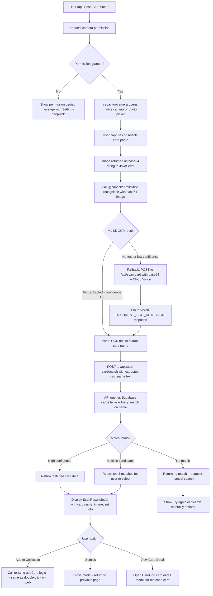

# Lumidex — Native iOS & Android App Plan

> **Status:** Planning — May 2026  
> **Stack:** Next.js 16 · Tailwind CSS v4 · React 19 · Supabase · Capacitor  
> **Goal:** Wrap the existing Next.js web app with Capacitor to ship native iOS and Android apps, plus add a card scanner feature using the device camera + ML Kit OCR

---

## Prerequisites

Before starting, confirm the PWA foundation is complete. **Sprint 4 of [`plans/mobile_responsive.md`](plans/mobile_responsive.md) is already done:**

| File | Status |
|------|--------|
| [`public/manifest.json`](public/manifest.json) | ✅ Done |
| [`public/sw.js`](public/sw.js) | ✅ Done |
| [`components/PwaRegister.tsx`](components/PwaRegister.tsx) | ✅ Done |
| [`app/layout.tsx`](app/layout.tsx) — PWA meta tags | ✅ Done |
| [`public/icons/icon-192.png`](public/icons/icon-192.png) | ✅ Done |
| [`public/icons/icon-512.png`](public/icons/icon-512.png) | ✅ Done |
| [`public/icons/apple-touch-icon.png`](public/icons/apple-touch-icon.png) | ✅ Done |

Also complete the responsive fixes from Sprints 1–3 of `mobile_responsive.md` before native wrapping — a good mobile web experience is the foundation of the native app.

---

## Part 1: Capacitor Setup

### 1.1 The Critical SSR vs. Static Export Decision

Lumidex uses **Next.js App Router with full server-side rendering**. Inspect [`next.config.js`](next.config.js): there is no `output: 'export'` directive — the app relies on SSR.

Capacitor works in one of two modes:

---

#### ❌ Option A: Static Export (`output: 'export'`)

Add `output: 'export'` to [`next.config.js`](next.config.js), run `next build`, and Capacitor bundles the resulting `out/` directory directly into the native binary.

**Pros:**
- App works fully offline (no network required for page navigation)
- Fastest possible page loads (everything bundled in the .ipa/.apk)
- True offline PWA

**Cons — why this will NOT work well for Lumidex:**
- All Next.js API routes (e.g., [`app/api/user-lists/route.ts`](app/api/user-lists/route.ts), [`app/api/trade-proposals/route.ts`](app/api/trade-proposals/route.ts), [`app/api/friendships/route.ts`](app/api/friendships/route.ts), pricing sync, etc.) **become dead** — they are server-only and cannot be bundled
- Supabase server-side calls (via [`lib/supabaseServer.ts`](lib/supabaseServer.ts)) also break
- Dynamic routes with server components require a running Next.js server
- Stripe integration ([`lib/stripe.ts`](lib/stripe.ts)) requires a server
- Cloudflare R2 image serving via [`lib/r2.ts`](lib/r2.ts) requires server-side signed URLs
- Image optimization (`next/image`) is disabled in static export mode
- Every page must be statically renderable — pages that depend on request-time auth cookies cannot be generated at build time

**Verdict: Not viable for Lumidex in its current form.** The app has ~40+ API routes and deep server-side Supabase dependency.

---

#### ✅ Option B: Server Target (Recommended for Lumidex)

Point Capacitor at the **live deployed URL** of the Next.js web app. The native app is essentially a hardened WebView wrapper around the production URL, but with full access to native device APIs (camera, haptics, notifications, etc.) via Capacitor plugins.

Set `server.url` in `capacitor.config.ts` to the production URL (e.g. `https://lumidex.app`). Capacitor opens this URL inside a `WKWebView` (iOS) or `WebView` (Android) on launch.

**Pros:**
- Zero changes to the existing Next.js codebase for the initial native wrap
- All API routes, Supabase calls, Stripe, R2 images — everything continues to work exactly as in the browser
- Native plugins (camera, haptics, push notifications) are overlayed on top of the web app
- App Store / Play Store distribution with a native install experience
- Single codebase to maintain — web and native share 100% of code
- PWA service worker ([`public/sw.js`](public/sw.js)) still caches static assets for faster loads and offline shell

**Cons:**
- Requires an internet connection for full functionality (same as the web app)
- App Store reviewers may scrutinize "wrapper apps" — app must provide clear native value (the card scanner does this)
- Deep links and URL routing need configuration
- App updates deploy instantly (no App Store review needed for web content changes) — but this can also be a **pro**

**Verdict: Option B is the correct choice for Lumidex.** Use `server.url` pointing to the live production URL.

---

### 1.2 Installation Commands

Run these commands from the project root (`f:/Programmering/Under utvikling/Lumidex`):

```bash
# Step 1: Install Capacitor core + CLI + platform packages
npm install @capacitor/core @capacitor/cli
npm install @capacitor/ios @capacitor/android

# Step 2: Install required native plugins
npm install @capacitor/camera
npm install @capacitor/status-bar
npm install @capacitor/splash-screen
npm install @capacitor/app
npm install @capacitor/haptics

# Step 3: Install ML Kit on-device text recognition (for card scanner)
npm install @capacitor-mlkit/text-recognition

# Step 4: Initialize Capacitor (run interactively)
npx cap init

# Step 5: Add platform targets
npx cap add ios
npx cap add android
```

> **Note on `npx cap init`:** This will ask for App Name (`Lumidex`) and App ID (`com.lumidex.app`). Alternatively, skip the interactive prompt by writing `capacitor.config.ts` manually (see below) and running `npx cap add ios` + `npx cap add android` directly.

---

### 1.3 `capacitor.config.ts`

Create this file at the project root:

```typescript
// capacitor.config.ts
import type { CapacitorConfig } from '@capacitor/cli'

const config: CapacitorConfig = {
  appId: 'com.lumidex.app',
  appName: 'Lumidex',

  // Option B: Point at the live Next.js server
  // The native app loads this URL in a WebView on launch.
  // Change to your actual production domain.
  server: {
    url: 'https://lumidex.app',
    cleartext: false,           // HTTPS only — never set true in production
    androidScheme: 'https',
  },

  // webDir is only used for static-export mode (Option A).
  // In Option B server mode, this is ignored at runtime but required by the CLI.
  // Set to 'out' (static export output) or '.next' — 'out' is conventional.
  webDir: 'out',

  plugins: {
    SplashScreen: {
      launchShowDuration: 2000,
      launchAutoHide: true,
      backgroundColor: '#0a0a0f',    // matches Lumidex --color-bg-base
      androidSplashResourceName: 'splash',
      androidScaleType: 'CENTER_CROP',
      showSpinner: false,
      splashFullScreen: true,
      splashImmersive: true,
    },
    StatusBar: {
      style: 'Dark',                  // white icons on dark background
      backgroundColor: '#0a0a0f',
    },
    Camera: {
      // Camera plugin settings are handled per-call, not here
    },
    App: {
      // Deep link configuration — handle lumidex:// scheme
    },
  },

  ios: {
    contentInset: 'automatic',
    // Required for WKWebView to maintain cookies across sessions (Supabase auth)
    allowsLinkPreview: false,
    scrollEnabled: true,
  },

  android: {
    allowMixedContent: false,        // HTTPS only
    captureInput: true,              // Ensure soft keyboard works properly
    webContentsDebuggingEnabled: false,  // Set true during development only
  },
}

export default config
```

---

### 1.4 Build & Sync Workflow

```bash
# Build the Next.js web app (for asset hashing / static resource updates)
npm run build

# Sync Capacitor — copies web assets + updates native plugin configs
npx cap sync

# Open native IDEs
npx cap open ios       # Opens Xcode (macOS only)
npx cap open android   # Opens Android Studio
```

For **Option B (server URL mode)**, `npx cap sync` primarily updates native plugin bindings and configuration. The actual web content is served from the live URL at runtime — you do **not** need to rebuild and sync the app when you deploy web changes. Only sync when:
- Capacitor plugins are added or updated
- `capacitor.config.ts` changes
- Native project configuration changes (permissions, icons, etc.)

---

### 1.5 Camera Permissions

#### iOS — `Info.plist`

After `npx cap add ios`, edit `ios/App/App/Info.plist` to add:

```xml
<!-- Camera permission — required for card scanner -->
<key>NSCameraUsageDescription</key>
<string>Lumidex uses your camera to scan and identify Pokémon cards for your collection.</string>

<!-- Photo library permission — for selecting existing card photos -->
<key>NSPhotoLibraryUsageDescription</key>
<string>Lumidex can read photos from your library to identify Pokémon cards.</string>

<!-- Photo library add permission — for saving scanned card images -->
<key>NSPhotoLibraryAddUsageDescription</key>
<string>Lumidex can save card images to your photo library.</string>
```

#### Android — `AndroidManifest.xml`

After `npx cap add android`, edit `android/app/src/main/AndroidManifest.xml` to add inside `<manifest>`:

```xml
<!-- Camera permission -->
<uses-permission android:name="android.permission.CAMERA" />
<uses-feature android:name="android.hardware.camera" android:required="false" />
<uses-feature android:name="android.hardware.camera.autofocus" android:required="false" />

<!-- Storage permissions (Android 12 and below) -->
<uses-permission android:name="android.permission.READ_EXTERNAL_STORAGE"
    android:maxSdkVersion="32" />
```

---

### 1.6 iOS Developer Requirements

> **No Mac?** See [Part 1b — Cloud Build Services](#part-1b--cloud-build-services-no-mac-required) below — iOS builds can be done entirely in the cloud via Codemagic. No macOS machine is required.

| Requirement | Details |
|-------------|---------|
| ~~macOS machine with Xcode~~ | **Not required** if using Codemagic/Appflow — cloud macOS build machine provided |
| Apple Developer Account | $99/year — enroll at [developer.apple.com](https://developer.apple.com) — **required regardless of build method** |
| Codemagic account | Free tier at [codemagic.io](https://codemagic.io) — provides the macOS build hardware |
| Bundle ID | `com.lumidex.app` — register in Apple Developer portal (web browser — no Mac needed) |
| Provisioning Profile | Auto-managed by Codemagic via App Store Connect API key |
| Code Signing Certificate | Auto-managed by Codemagic automatic code signing |
| Device for testing | Physical iPhone recommended; install `.ipa` via TestFlight (no Mac needed) |

### 1.7 Android Developer Requirements

| Requirement | Details |
|-------------|---------|
| Android Studio | Download from [developer.android.com](https://developer.android.com/studio) |
| JDK | Android Studio bundles JDK — no separate install needed |
| Google Play Developer Account | $25 one-time — [play.google.com/console](https://play.google.com/console) |
| Package name | `com.lumidex.app` — set in `build.gradle` |
| Keystore | Generate once: `keytool -genkey -v -keystore lumidex.keystore` — keep this file secure and backed up |
| Target SDK | Android 14 (API 34) minimum for new Play Store submissions |

---

## Part 1b — Cloud Build Services (No Mac Required)

> **Context:** You do not need a macOS machine to build and publish iOS apps. Cloud build services provide real macOS machines in the cloud that compile your Xcode project, sign the `.ipa`, and upload directly to TestFlight or the App Store. You **do** still need an Apple Developer account ($99/year) — the cloud service just provides the Mac hardware.

---

### Option A: Codemagic — Recommended (Free Tier Available)

**URL:** [https://codemagic.io](https://codemagic.io)

Codemagic is purpose-built for Capacitor, Flutter, and React Native apps. It has first-class native Capacitor support with a dedicated build environment.

| Attribute | Details |
|-----------|---------|
| Free tier | 500 build minutes/month — enough for testing and occasional releases |
| Paid tier | ~$95/month for 3 concurrent builds |
| iOS builds | Real macOS build machines — produces `.ipa` files |
| Android builds | Linux machines — produces `.apk` / `.aab` files |
| Trigger | Connects to GitHub repo — push to branch triggers a build automatically |
| iOS delivery | Submits directly to TestFlight and App Store Connect |
| Android delivery | Submits directly to Google Play (any track) |
| Config file | `codemagic.yaml` in the repo root |
| Code signing | Automatic code signing via App Store Connect API key — no manual certificate handling |

**What Codemagic provides:** macOS hardware + Xcode + CocoaPods + the build pipeline.
**What you still need:** Apple Developer account ($99/year) and an App Store Connect API key (generated on the web — no Mac needed).

---

### Option B: Ionic Appflow

**URL:** [https://ionic.io/appflow](https://ionic.io/appflow)

Official cloud build service from Ionic — the same company that makes Capacitor.

| Attribute | Details |
|-----------|---------|
| Pricing | $49/month starter plan |
| Integration | Tighter Capacitor tooling integration (same vendor) |
| iOS/Android | Full native builds in the cloud |
| Delivery | TestFlight + App Store Connect; Google Play |

Slightly more expensive than Codemagic but simpler configuration for Capacitor specifically.

---

### Option C: GitHub Actions with macOS Runners

GitHub provides hosted `macos-latest` runners that can run Xcode builds.

| Attribute | Details |
|-----------|---------|
| Cost | macOS minutes cost ~10× the Linux rate — expensive for frequent builds |
| Free repos | Unlimited minutes for public repos |
| Private repos | Limited free minutes; paid per-minute beyond that |
| Best for | Occasional release builds, not rapid iteration |
| Config file | `.github/workflows/ios-release.yml` |

**Example GitHub Actions workflow:**

```yaml
# .github/workflows/ios-release.yml
name: iOS Release Build

on:
  push:
    branches: [main]

jobs:
  build-ios:
    runs-on: macos-latest
    steps:
      - uses: actions/checkout@v4

      - name: Set up Node.js
        uses: actions/setup-node@v4
        with:
          node-version: 20

      - name: Install dependencies
        run: npm ci

      - name: Capacitor sync
        run: npx cap sync ios

      - name: Install CocoaPods
        run: cd ios/App && pod install

      - name: Build iOS (unsigned for testing)
        run: |
          xcodebuild \
            -workspace ios/App/App.xcworkspace \
            -scheme App \
            -configuration Release \
            -sdk iphoneos \
            CODE_SIGN_IDENTITY="" \
            CODE_SIGNING_REQUIRED=NO \
            build
```

> For a signed production build via GitHub Actions, you must import your distribution certificate and provisioning profile as repository secrets — a more complex setup than Codemagic's automatic signing.

---

### `codemagic.yaml` — Production-Ready Example

Create this file at the **repo root** (`codemagic.yaml`). Codemagic reads it automatically when connected to your GitHub repo.

```yaml
workflows:
  ios-release:
    name: iOS Release
    max_build_duration: 60
    environment:
      ios_signing:
        distribution_type: app_store
        bundle_identifier: com.lumidex.app
      vars:
        BUNDLE_ID: "com.lumidex.app"
        XCODE_WORKSPACE: "ios/App/App.xcworkspace"
        XCODE_SCHEME: "App"
      node: 20.0.0
      xcode: latest
      cocoapods: default
    scripts:
      - name: Install dependencies
        script: npm ci
      - name: Capacitor sync
        script: npx cap sync ios
      - name: Install CocoaPods
        script: cd ios/App && pod install
      - name: Build iOS
        script: |
          xcode-project build-ipa \
            --workspace "$XCODE_WORKSPACE" \
            --scheme "$XCODE_SCHEME"
    artifacts:
      - build/ios/ipa/*.ipa
    publishing:
      app_store_connect:
        api_key: $APP_STORE_CONNECT_PRIVATE_KEY
        key_id: $APP_STORE_CONNECT_KEY_IDENTIFIER
        issuer_id: $APP_STORE_CONNECT_ISSUER_ID
        submit_to_testflight: true

  android-release:
    name: Android Release
    max_build_duration: 60
    environment:
      android_signing:
        - keystore_reference
      vars:
        PACKAGE_NAME: "com.lumidex.app"
      node: 20.0.0
      java: 17
    scripts:
      - name: Install dependencies
        script: npm ci
      - name: Capacitor sync
        script: npx cap sync android
      - name: Build Android
        script: cd android && ./gradlew bundleRelease
    artifacts:
      - android/app/build/outputs/**/*.aab
    publishing:
      google_play:
        credentials: $GCLOUD_SERVICE_ACCOUNT_CREDENTIALS
        track: internal
```

**Codemagic environment variables to set** (in the Codemagic web dashboard under Team → Environment variables):

| Variable | Where to get it |
|----------|----------------|
| `APP_STORE_CONNECT_PRIVATE_KEY` | App Store Connect → Users and Access → Keys → Download `.p8` file |
| `APP_STORE_CONNECT_KEY_IDENTIFIER` | The Key ID shown next to the key in App Store Connect |
| `APP_STORE_CONNECT_ISSUER_ID` | App Store Connect → Users and Access → Keys → Issuer ID at the top |
| `GCLOUD_SERVICE_ACCOUNT_CREDENTIALS` | Google Play Console → Setup → API access → Create service account |

---

### Apple Developer Account Setup (Windows — No Mac Required)

All of the following steps can be completed on Windows using a web browser only:

1. **Create Apple Developer account** — go to [developer.apple.com](https://developer.apple.com) in any browser and enroll ($99/year). Requires an Apple ID.
2. **Register App ID** — in the Apple Developer portal: Identifiers → `+` → App ID → set Bundle ID to `com.lumidex.app`.
3. **Create app record in App Store Connect** — go to [appstoreconnect.apple.com](https://appstoreconnect.apple.com) → My Apps → `+` → New App → select the Bundle ID registered above.
4. **Generate App Store Connect API key** — App Store Connect → Users and Access → Keys → `+` → name it `Codemagic`, role `App Manager` → download the `.p8` private key file. **This file can only be downloaded once — save it securely.**
5. **Add the API key to Codemagic** — paste `APP_STORE_CONNECT_PRIVATE_KEY` (contents of the `.p8` file), `APP_STORE_CONNECT_KEY_IDENTIFIER` (Key ID), and `APP_STORE_CONNECT_ISSUER_ID` into Codemagic environment variables.
6. **Codemagic handles the rest** — certificate generation, provisioning profile creation, and code signing are all managed automatically using the API key. No Keychain, no Xcode, no Mac.

---

## Part 2: Card Scanner Feature Architecture

### 2.1 OCR Technology Choice

Two options are available for extracting text from card images:

#### Option A: ML Kit On-Device Text Recognition (Recommended)

**Package:** `@capacitor-mlkit/text-recognition`

| Attribute | Value |
|-----------|-------|
| Cost | Free — no API key, no cloud calls |
| Privacy | Card image never leaves the device |
| Works offline | Yes — model runs entirely on-device |
| Accuracy | Excellent for clear card text (handles printed card fonts well) |
| Latency | ~200–500ms on modern devices |
| Setup | Just `npm install` + native sync, no Google Cloud account needed |
| iOS support | Uses Vision framework (built into iOS 13+) |
| Android support | Uses Google ML Kit (bundled in the APK) |

**Recommendation: Use ML Kit as the primary OCR engine.** It is free, private, fast, and works offline.

#### Option B: Google Cloud Vision API (Fallback for Higher Accuracy)

**Package:** Standard `fetch` to the Cloud Vision REST API

| Attribute | Value |
|-----------|-------|
| Cost | ~$1.50 per 1,000 images; first 1,000/month free |
| Privacy | Card image (base64) is sent to Google servers |
| Works offline | No — requires network connection |
| Accuracy | Highest available — `DOCUMENT_TEXT_DETECTION` handles dense text |
| Latency | ~1–2 seconds (network round-trip) |
| Setup | Google Cloud project, billing, API key |
| API key env var | `GOOGLE_CLOUD_VISION_API_KEY` |

**Use Cloud Vision only as a fallback** if ML Kit fails to identify a card (low confidence or no match found).

---

### 2.2 Full Scanner Flow



---

### 2.3 New API Routes

#### `POST /api/scan-card` — Cloud Vision OCR (fallback only)

**File to create:** `app/api/scan-card/route.ts`

**Request body:**
```typescript
{
  imageBase64: string   // Base64-encoded JPEG or PNG — no data URI prefix
}
```

**Response:**
```typescript
{
  text: string          // Raw OCR text extracted from the image
  confidence?: number   // Overall detection confidence (0–1)
}
```

**Implementation:**
```typescript
// app/api/scan-card/route.ts
import { NextRequest, NextResponse } from 'next/server'

const VISION_API_URL =
  'https://vision.googleapis.com/v1/images:annotate'

export async function POST(req: NextRequest) {
  const { imageBase64 } = await req.json()

  const apiKey = process.env.GOOGLE_CLOUD_VISION_API_KEY
  if (!apiKey) {
    return NextResponse.json({ error: 'Vision API not configured' }, { status: 501 })
  }

  const visionPayload = {
    requests: [
      {
        image: { content: imageBase64 },
        features: [{ type: 'DOCUMENT_TEXT_DETECTION', maxResults: 1 }],
      },
    ],
  }

  const response = await fetch(`${VISION_API_URL}?key=${apiKey}`, {
    method: 'POST',
    headers: { 'Content-Type': 'application/json' },
    body: JSON.stringify(visionPayload),
  })

  const data = await response.json()
  const annotation = data.responses?.[0]?.fullTextAnnotation

  return NextResponse.json({
    text: annotation?.text ?? '',
    confidence: annotation?.pages?.[0]?.confidence ?? 0,
  })
}
```

---

#### `POST /api/scan-card/match` — Card Name Matching

**File to create:** `app/api/scan-card/match/route.ts`

**Request body:**
```typescript
{
  ocrText: string       // Raw OCR text from ML Kit or Cloud Vision
}
```

**Response:**
```typescript
{
  matches: Array<{
    id: string
    name: string
    set_name: string
    set_id: string
    image_url: string | null
    confidence: number    // 0–1 match score
  }>
}
```

**Matching logic:**

1. **Extract candidate card name** from the OCR text:
   - Pokémon card names appear prominently (large font) — typically the first or second line of text
   - Strip set number patterns (e.g., `123/165`) and HP values (e.g., `HP 120`)
   - Take the first 1–3 non-numeric tokens as the candidate name

2. **Query Supabase `cards` table** using PostgreSQL `ilike` fuzzy matching:
   ```sql
   SELECT id, name, set_id, image_url
   FROM cards
   WHERE name ILIKE '%<candidate_name>%'
   ORDER BY similarity(name, '<candidate_name>') DESC
   LIMIT 5;
   ```
   Enable the `pg_trgm` extension on Supabase for `similarity()` support:
   ```sql
   CREATE EXTENSION IF NOT EXISTS pg_trgm;
   ```

3. **Score matches** by:
   - Exact name match → confidence `1.0`
   - Partial match (OCR text contains the card name) → confidence `0.8`
   - Trigram similarity > 0.6 → confidence proportional to similarity score

4. **Return top 3 matches** sorted by confidence descending.

---

### 2.4 Google Cloud Vision Setup (Optional Fallback)

If implementing the Cloud Vision fallback:

1. Go to [console.cloud.google.com](https://console.cloud.google.com)
2. Create a new project: `lumidex-production`
3. Enable the **Cloud Vision API** (APIs & Services → Library → search "Cloud Vision API")
4. Create an API key (APIs & Services → Credentials → Create Credentials → API Key)
5. Restrict the key to **Cloud Vision API only** and to your server's IP or domain
6. Add to your environment variables:
   ```
   GOOGLE_CLOUD_VISION_API_KEY=AIza...
   ```
7. Add to `.env.local` (never commit this file):
   ```
   GOOGLE_CLOUD_VISION_API_KEY=AIza...
   ```
8. Add to your Vercel (or hosting) environment variables dashboard

**Cost estimate:** The first 1,000 image annotations per month are free. At $1.50/1,000 thereafter, even 10,000 scans/month costs only $13.50. For a card collection app with infrequent scanning, costs are negligible.

---

### 2.5 ML Kit Integration (Primary OCR Engine)

**Client-side usage in the scanner component:**

```typescript
// components/scanner/CardScanner.tsx (new file)
import { Camera, CameraResultType, CameraSource } from '@capacitor/camera'
import { TextRecognition } from '@capacitor-mlkit/text-recognition'

export async function scanCard(): Promise<string> {
  // Step 1: Capture image via native camera
  const photo = await Camera.getPhoto({
    quality: 90,
    allowEditing: false,
    resultType: CameraResultType.Base64,
    source: CameraSource.Camera,   // or CameraSource.Photos for gallery
    correctOrientation: true,
    width: 1200,                    // Sufficient resolution for OCR
    height: 900,
  })

  if (!photo.base64String) throw new Error('No image captured')

  // Step 2: Run on-device OCR via ML Kit
  const { lines } = await TextRecognition.recognize({
    base64String: photo.base64String,
    dataUrlCString: `data:image/jpeg;base64,${photo.base64String}`,
  })

  // Step 3: Concatenate all recognized lines
  return lines.map(l => l.text).join('\n')
}
```

> **Fallback:** If [`TextRecognition.recognize()`](https://github.com/capawesome-team/capacitor-mlkit) returns empty text or throws, POST the `base64String` to `/api/scan-card` for Cloud Vision processing.

---

## Part 3: UI Changes Needed for Scanner

### 3.1 Scan Entry Point — Floating Action Button (FAB)

**Where:** Bottom-right corner of the Collection and Browse pages, visible only on mobile (hidden on desktop via Tailwind).

**File to create:** `components/scanner/ScanFab.tsx`

```
Position:  fixed bottom-6 right-6 z-40
Visibility: flex sm:hidden   (mobile only)
Size:       w-16 h-16 rounded-full
Icon:       Camera icon (HeroIcons CameraIcon)
Style:      bg-indigo-600 hover:bg-indigo-500 active:scale-95 shadow-lg shadow-indigo-900/50
```

Add the FAB to:
- [`app/collection/page.tsx`](app/collection/page.tsx) (or equivalent collection route)
- [`app/browse/page.tsx`](app/browse/page.tsx) (or equivalent browse route)

**Fallback for web (non-Capacitor):** Detect if running in a Capacitor context:
```typescript
import { Capacitor } from '@capacitor/core'
const isNative = Capacitor.isNativePlatform()
```
Only render the FAB when `isNative` is true (or always render and show an appropriate message on web if the camera plugin is unavailable).

---

### 3.2 Scanner Modal

**File to create:** `components/scanner/ScannerModal.tsx`

States to handle:

| State | UI |
|-------|----|
| `idle` | "Scan a Pokémon Card" title, camera preview area, "Take Photo" + "Choose from Library" buttons |
| `scanning` | Animated spinner overlay, "Identifying card..." text |
| `matched` | `ScanResultCard` component showing the matched card |
| `multi-match` | List of up to 3 candidate cards for user to select |
| `no-match` | "Card not recognized" message with "Try Again" + "Search Manually" buttons |
| `error` | Error message with "Try Again" button |

```
Layout:
  - Dialog/Sheet that slides up from the bottom (bottom sheet pattern on mobile)
  - max-h-[90vh] overflow-y-auto
  - Rounded top corners: rounded-t-2xl
  - Dark background: bg-zinc-900
  - Close button (×) in top-right corner: p-3 min-w-[44px] min-h-[44px]
```

---

### 3.3 Scan Result Card

**File to create:** `components/scanner/ScanResultCard.tsx`

```
Layout:
  - Matched card image (150×210px, rounded-lg, shadow)
  - Card name (text-xl font-bold)
  - Set name + set icon
  - Confidence badge (if < 0.9: "Best match" tag)
  - "Add to Collection" button (full-width, indigo, prominent)
  - "View Card Details" secondary button (opens existing CardGrid modal)
  - "Not this card? Search manually" text link
```

---

### 3.4 Navbar Scanner Integration (Optional)

Add a camera icon button to the Navbar mobile bar (between the notification bell and avatar) that opens the scanner modal. This provides a persistent entry point from any page.

Edit [`components/Navbar.tsx`](components/Navbar.tsx):
```
Add: <button onClick={openScanner} className="flex sm:hidden p-2 ...">
       <CameraIcon className="w-6 h-6" />
     </button>
```

---

## Part 4: App Store Submission Checklist

### 4.1 iOS App Store

#### App Identity

| Item | Value | Status |
|------|-------|--------|
| Bundle ID | `com.lumidex.app` | Register at developer.apple.com |
| Display Name | `Lumidex` | |
| Version | `1.0.0` | |
| Build Number | `1` | Increment with each TestFlight upload |
| Minimum iOS | 16.0 | Covers WKWebView features used |

#### App Icons

Capacitor requires icons at all required iOS sizes. Generate from [`public/icons/icon-512.png`](public/icons/icon-512.png) using a tool like [appicon.co](https://appicon.co) or the Xcode asset catalog generator.

Required sizes for iOS App Store:
```
1024×1024  — App Store listing icon (no alpha channel)
180×180    — iPhone @3x (Home Screen)
120×120    — iPhone @2x (Home Screen)  
167×167    — iPad Pro @2x (Home Screen)
152×152    — iPad @2x (Home Screen)
76×76      — iPad @1x (Home Screen)
```

Place generated PNGs in `ios/App/App/Assets.xcassets/AppIcon.appiconset/`.

#### Splash Screen

| Item | Spec |
|------|------|
| Background color | `#0a0a0f` (matches Lumidex dark background) |
| Logo | Centered Lumidex logo, 300×300px max |
| Duration | 2 seconds (configured in `capacitor.config.ts`) |

Generate using the `@capacitor/splash-screen` plugin. The `@capacitor/assets` CLI tool can generate all required splash screen sizes:
```bash
npx @capacitor/assets generate --ios
```

#### Privacy & Legal

| Requirement | Details |
|-------------|---------|
| Privacy Policy URL | Required — create at e.g. `https://lumidex.app/privacy` |
| `NSCameraUsageDescription` | "Lumidex uses your camera to scan and identify Pokémon cards." |
| `NSPhotoLibraryUsageDescription` | "Lumidex reads photos to identify Pokémon cards for your collection." |
| Age Rating | 4+ (no objectionable content; Pokémon card collecting) |
| Content Rights | Confirm you have rights to display Pokémon card images (fair use / API data) |

#### TestFlight Beta Testing

1. Archive the app in Xcode (Product → Archive)
2. Upload to App Store Connect via Xcode Organizer
3. Invite internal testers (up to 100) via App Store Connect
4. Invite external testers (up to 10,000) — triggers brief Apple review of the build
5. Collect feedback for at least 1–2 weeks before public submission

#### App Store Connect Metadata

```
App Name:        Lumidex — Pokémon TCG Tracker
Subtitle:        Collect, Track & Value Your Cards
Category:        Primary: Entertainment  Secondary: Utilities
Keywords:        pokemon tcg, card tracker, collection, pokemon cards, 
                 pokedex, trading cards, card scanner, binder
Description:     Track your entire Pokémon TCG collection, monitor card values,
                 scan cards with your camera, and connect with other collectors.
Promotional Text: Now with card scanning — point your camera at any Pokémon 
                 card to instantly identify and add it to your collection.
Support URL:     https://lumidex.app/support
Marketing URL:   https://lumidex.app
```

---

### 4.2 Google Play Store

#### App Identity

| Item | Value | Status |
|------|-------|--------|
| Package Name | `com.lumidex.app` | Set in `android/app/build.gradle` |
| App Name | `Lumidex` | |
| Version Name | `1.0.0` | |
| Version Code | `1` | Integer, increment for each release |
| Minimum SDK | API 26 (Android 8.0) | `minSdkVersion` in `build.gradle` |
| Target SDK | API 34 (Android 14) | Required by Play Store since Aug 2024 |

#### App Icons

Required format: Adaptive Icon (foreground + background layers):
```
512×512   — Play Store listing icon (PNG, no alpha)
108×108   — Adaptive icon foreground (xxxhdpi)
48×48     — Adaptive icon background (mdpi)
```

Generate using:
```bash
npx @capacitor/assets generate --android
```

Or manually place in `android/app/src/main/res/` subdirectories.

#### Play Store Listing Assets

| Asset | Spec |
|-------|------|
| Feature Graphic | 1024×500 PNG or JPG — banner image shown at top of listing |
| Screenshots | Minimum 2, maximum 8 per device type (phone, tablet) |
| Short Description | Max 80 characters: "Track, value and scan your Pokémon TCG collection" |
| Full Description | Max 4,000 characters |

#### Privacy & Legal

| Requirement | Details |
|-------------|---------|
| Privacy Policy URL | Same URL as iOS: `https://lumidex.app/privacy` |
| Data Safety Form | Complete in Play Console — declare: account info (email), collection data, no data sold |
| Content Rating | Complete IARC questionnaire — expects "Everyone" rating for a card collecting app |
| Camera permission declaration | Declare in Data Safety: camera used for card scanning, not stored remotely |

#### Internal Testing Track

1. Build a signed release APK / AAB:
   ```bash
   cd android && ./gradlew bundleRelease
   ```
2. Upload to Google Play Console → Internal Testing
3. Share with up to 100 internal testers via email list
4. Graduate to Closed Testing (Alpha) → Open Testing (Beta) → Production

---

## Part 5: Recommended Implementation Order

### Phase 1 — Native Wrapper (MVP)

**Goal:** Get Lumidex installable on a real iPhone and Android device ASAP.

```
[ ] 1.1  Install Capacitor packages (core, cli, ios, android, camera, status-bar, splash-screen, app, haptics)
[ ] 1.2  Create capacitor.config.ts with server.url pointing to production
[ ] 1.3  Run npx cap add ios and npx cap add android
[ ] 1.4  Add camera permissions to Info.plist and AndroidManifest.xml
[ ] 1.5  Generate app icons from public/icons/icon-512.png (all iOS + Android sizes)
[ ] 1.6  Configure splash screen (dark background, centered logo)
[ ] 1.7  Run npx cap sync
[ ] 1.8  Connect GitHub repo to Codemagic (codemagic.io) — authorize GitHub access
[ ] 1.9  Add codemagic.yaml to repo root (use the template in Part 1b)
[ ] 1.10 Add Apple Developer API key to Codemagic environment variables (APP_STORE_CONNECT_PRIVATE_KEY, KEY_IDENTIFIER, ISSUER_ID)
[ ] 1.11 Trigger first iOS build on Codemagic — download the .ipa artifact and distribute via TestFlight
[ ] 1.12 Open in Android Studio on Windows — verify app loads the production URL in WebView (no Mac required for Android)
[ ] 1.13 Fix any WKWebView-specific rendering issues (safe area insets, status bar overlap) — test on physical iPhone via TestFlight
[ ] 1.14 Upload first AAB to Google Play Internal Testing (build locally via Android Studio or via Codemagic android-release workflow)
```

### Phase 2 — Card Scanner

**Goal:** The primary native-value feature that differentiates the app from the PWA.

```
[ ] 2.1  Install @capacitor-mlkit/text-recognition
[ ] 2.2  Update npx cap sync to include ML Kit native bindings
[ ] 2.3  Create components/scanner/CardScanner.ts (camera capture + ML Kit OCR logic)
[ ] 2.4  Create app/api/scan-card/route.ts (Cloud Vision fallback)
[ ] 2.5  Enable pg_trgm extension on Supabase for fuzzy card name matching
[ ] 2.6  Create app/api/scan-card/match/route.ts (Supabase fuzzy search)
[ ] 2.7  Create components/scanner/ScanFab.tsx (floating action button)
[ ] 2.8  Create components/scanner/ScannerModal.tsx (states: idle, scanning, matched, no-match)
[ ] 2.9  Create components/scanner/ScanResultCard.tsx (matched card display + Add to Collection)
[ ] 2.10 Add ScanFab to collection and browse pages (sm:hidden)
[ ] 2.11 Add Capacitor.isNativePlatform() guard so FAB only shows in native app
[ ] 2.12 Test scanner with a variety of card types (holos, reverse holos, GX, EX, V)
[ ] 2.13 Handle edge cases: damaged cards, glare, cards in sleeves, Japanese cards
```

### Phase 3 — Native Polish

**Goal:** Native feel — haptics, deep links, push notifications.

```
[ ] 3.1  Add haptic feedback on card add (Haptics.impact()) -- feels satisfying
[ ] 3.2  Configure deep links (lumidex:// URL scheme) for share functionality
[ ] 3.3  Add App plugin to handle back-button behavior on Android
[ ] 3.4  StatusBar.setStyle() -- update style when modals open (light text on dark overlay)
[ ] 3.5  SplashScreen.hide() after app is loaded (prevent white flash)
[ ] 3.6  Add pull-to-refresh on collection page (Capacitor has no plugin -- use custom touch handler)
[ ] 3.7  Test all Navbar polling behavior (friendships, trade proposals) in WebView context
[ ] 3.8  Verify Supabase auth cookies persist correctly in WKWebView (iOS cookie storage)
```

### Phase 4 — App Store Submission

```
[ ] 4.1  Create privacy policy page at /privacy (required by both stores)
[ ] 4.2  Write App Store Connect listing copy (name, description, keywords, screenshots)
[ ] 4.3  Record screenshots on iPhone 14 Pro Max (6.7") and iPad Pro (required sizes)
[ ] 4.4  Record screenshots on Pixel 7 or Samsung Galaxy for Play Store
[ ] 4.5  Create Play Store feature graphic (1024x500)
[ ] 4.6  Complete App Store Review Guidelines self-check (section 4.2 on web views)
[ ] 4.7  Complete Play Store Data Safety declaration
[ ] 4.8  Submit to App Store review (expect 1-3 day review time)
[ ] 4.9  Submit to Play Store production (expect 1-7 day review time)
```

### Phase 5 — Post-Launch

```
[ ] 5.1  Monitor crash reports (Xcode Organizer + Google Play Android Vitals)
[ ] 5.2  Respond to App Store / Play Store reviews
[ ] 5.3  Evaluate push notifications for trade proposal alerts (using @capacitor/push-notifications)
[ ] 5.4  Evaluate biometric auth (Face ID / fingerprint) for app unlock via @capacitor/biometric-auth
[ ] 5.5  Consider in-app purchases for Pro subscription (StoreKit on iOS, Google Play Billing on Android)
         Note: Apple charges 30% commission on IAP -- Stripe web checkout may be preferable
[ ] 5.6  A/B test scanner accuracy improvements: consider training a custom Vision model
         on Pokémon card layouts for near-100% name extraction accuracy
```

---

## Architecture Diagram

```mermaid
graph TD
    A[Lumidex Native App -- Capacitor WebView] --> B[Production URL: lumidex.app]
    B --> C[Next.js 16 App Router -- Vercel]
    C --> D[Supabase -- Auth + DB]
    C --> E[Cloudflare R2 -- Card Images]
    C --> F[Stripe -- Subscriptions]
    
    A --> G[Capacitor Plugin Bridge -- Native Layer]
    G --> H[@capacitor/camera -- WKWebView / Chromium]
    G --> I[@capacitor-mlkit/text-recognition -- on-device ML]
    G --> J[@capacitor/haptics -- vibration motor]
    G --> K[@capacitor/status-bar -- native chrome]
    G --> L[@capacitor/splash-screen -- launch screen]
    G --> M[@capacitor/app -- deep links / back button]
    
    H --> N[ScannerModal -- React component]
    I --> N
    N --> O[POST /api/scan-card/match]
    O --> P[Supabase: SELECT cards WHERE name ILIKE ...]
    P --> Q[ScanResultCard -- show matched card]
    Q --> R[Add to Collection -- existing userCards logic]
```

---

## Key Files Reference

| File | Purpose | Action |
|------|---------|--------|
| `capacitor.config.ts` | Capacitor root config | **Create new** |
| `ios/` | Xcode project (generated) | Generated by `npx cap add ios` |
| `android/` | Android Studio project (generated) | Generated by `npx cap add android` |
| `ios/App/App/Info.plist` | iOS permissions | Add camera usage descriptions |
| `android/app/src/main/AndroidManifest.xml` | Android permissions | Add camera permission |
| [`app/api/scan-card/route.ts`](app/api/scan-card/route.ts) | Cloud Vision OCR fallback | **Create new** |
| [`app/api/scan-card/match/route.ts`](app/api/scan-card/match/route.ts) | Supabase card name fuzzy match | **Create new** |
| [`components/scanner/CardScanner.ts`](components/scanner/CardScanner.ts) | Camera capture + ML Kit OCR | **Create new** |
| [`components/scanner/ScanFab.tsx`](components/scanner/ScanFab.tsx) | Floating action button | **Create new** |
| [`components/scanner/ScannerModal.tsx`](components/scanner/ScannerModal.tsx) | Scanner UI state machine | **Create new** |
| [`components/scanner/ScanResultCard.tsx`](components/scanner/ScanResultCard.tsx) | Matched card display | **Create new** |
| [`next.config.js`](next.config.js) | Next.js config | No changes needed for Option B |
| [`app/layout.tsx`](app/layout.tsx) | App shell | No changes needed (PWA tags already present) |
| [`public/manifest.json`](public/manifest.json) | Web App Manifest | Already done |
| [`public/sw.js`](public/sw.js) | Service Worker | Already done |

---

## Risks & Mitigations

| Risk | Likelihood | Mitigation |
|------|-----------|------------|
| App Store rejection for "thin wrapper" app | Medium | The card scanner feature provides genuine native value beyond the web app. Clearly demonstrate this in the App Store description and screenshots. |
| WKWebView cookie behavior breaks Supabase auth | Medium | Use [`@capacitor/cookie-plugin`](https://www.npmjs.com/package/@capacitor/cookie-plugin) if needed; test auth flow thoroughly on device |
| ML Kit fails on holographic/foil cards | Medium | Fallback to Cloud Vision; add a "Try again with better lighting" UX guide |
| Android WebView version compatibility | Low | Specify `minSdkVersion 26` in `build.gradle`; Android 8+ has modern Chromium WebView |
| Apple 30% IAP commission vs. Stripe | High | Keep Pro subscription purchases on the web (Stripe); do not implement IAP initially. Note: Apple requires IAP for in-app purchases on iOS — linking to web checkout is permitted but Apple may reject if it's the primary purchase flow. Research Apple's "Reader App" exception. |
| Google Play Data Safety form complexity | Low | Camera data (base64 during ML Kit scan) is processed locally and never stored. Clearly state this in the Data Safety form. |

---

*Plan created: May 2026*  
*Related plans: [`plans/mobile_responsive.md`](plans/mobile_responsive.md) (Sprints 1–4), [`plans/membership_tiers.md`](plans/membership_tiers.md) (Pro subscription context)*
