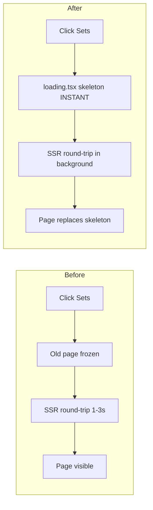

# Navbar Navigation Performance Plan

## Diagnosis

Clicking navbar links feels slow because of three layered problems that compound each other.

### Problem 1 — No `loading.tsx` files (PRIMARY CAUSE)

**Zero `loading.tsx` files exist anywhere in `app/`.**

In Next.js App Router, `loading.tsx` is the mechanism that gives *instant* visual feedback during navigation. Without it:

- **Server Component routes** (`/sets`, `/browse`): Both have `export const dynamic = 'force-dynamic'`, which means every click triggers a full SSR round-trip. Without `loading.tsx`, Next.js keeps the old page visible and frozen while the server processes the request. If Supabase has a cold connection, this is 1–3 seconds of a stale, unresponsive page.
- **Client Component routes** (`/dashboard`, `/collection`, `/profile`): The JS chunk for each page is code-split. On first visit, the browser must download the chunk. Without `loading.tsx`, nothing shows during this download.

The fix is immediate: Next.js shows `loading.tsx` **synchronously before any async work begins**, so the user sees a skeleton the instant they click.

### Problem 2 — Dashboard calls `fetchPokemonSets()` on every mount

`app/dashboard/page.tsx` line 47–49:

```ts
useEffect(() => {
  fetchPokemonSets()         // ← no guard, fires on every dashboard visit
}, [fetchPokemonSets])
```

The Collection page guards this correctly (`if (pokemonSets.size === 0) fetchPokemonSets()`), but the Dashboard does not. Every time the user navigates back to `/dashboard`, a fresh `GET /api/sets` request fires — even though the store already has all the data. This is a wasted network round-trip that also triggers a re-render when the response arrives.

### Problem 3 — `fetchPokemonSets()` has no in-flight deduplication

If two components mount simultaneously and both call `fetchPokemonSets()`, two identical `/api/sets` requests go out in parallel. The store has no `isLoading` flag to short-circuit a second call that arrives while the first is still in-flight. For example: `onAuthStateChange` triggers collection fetches, while the Dashboard's `useEffect` fires at the same time — depending on race conditions, duplicate calls can happen.

---

## How `loading.tsx` Works in Next.js App Router

```
User clicks Link
       │
       ▼
Next.js Router intercepts (client-side navigation)
       │
       ├─── Renders loading.tsx IMMEDIATELY (instant skeleton visible)
       │
       ├─── For Server Components: fetches RSC payload from server
       │    For Client Components: downloads JS chunk
       │
       ▼
Page content ready → replaces loading.tsx
```

The `loading.tsx` file is **co-located** with `page.tsx` in the same directory. It wraps `page.tsx` in a `<Suspense>` boundary automatically.

---

## Implementation Plan

### Phase 1 — Add `loading.tsx` to all navbar routes (highest impact)

Each file exports a skeleton that mirrors the visual structure of its page using `div.skeleton` elements (the project already uses `.skeleton` CSS class).

#### `app/sets/loading.tsx` — SSR route, MOST IMPACTFUL

```tsx
export default function SetsLoading() {
  return (
    <div className="min-h-screen bg-base">
      <div className="max-w-screen-2xl mx-auto px-6 py-8 space-y-6">
        {/* Header */}
        <div className="skeleton h-10 w-48 rounded-xl" />
        {/* Series filter row */}
        <div className="flex gap-2">
          {Array.from({ length: 6 }).map((_, i) => (
            <div key={i} className="skeleton h-8 w-24 rounded-lg shrink-0" />
          ))}
        </div>
        {/* Sets grid */}
        <div className="grid grid-cols-2 sm:grid-cols-3 md:grid-cols-4 xl:grid-cols-5 gap-4">
          {Array.from({ length: 20 }).map((_, i) => (
            <div key={i} className="skeleton h-40 rounded-2xl" />
          ))}
        </div>
      </div>
    </div>
  )
}
```

#### `app/browse/loading.tsx` — SSR route, HIGH IMPACT

```tsx
export default function BrowseLoading() {
  return (
    <div className="min-h-screen bg-base">
      <div className="max-w-screen-2xl mx-auto px-6 py-8 space-y-6">
        {/* Hero search bar */}
        <div className="skeleton h-24 rounded-2xl" />
        {/* Mode tabs */}
        <div className="flex gap-2">
          {Array.from({ length: 4 }).map((_, i) => (
            <div key={i} className="skeleton h-9 w-20 rounded-lg" />
          ))}
        </div>
        {/* Results grid */}
        <div className="grid grid-cols-2 sm:grid-cols-3 md:grid-cols-4 xl:grid-cols-5 gap-4">
          {Array.from({ length: 15 }).map((_, i) => (
            <div key={i} className="skeleton h-48 rounded-2xl" />
          ))}
        </div>
      </div>
    </div>
  )
}
```

#### `app/dashboard/loading.tsx`

The dashboard page already has an inline skeleton for the `isLoading` auth state. The `loading.tsx` handles the earlier phase (JS chunk download + component mount). Reuse the same skeleton shape.

```tsx
export default function DashboardLoading() {
  return (
    <div className="min-h-screen bg-base">
      <div className="max-w-screen-2xl mx-auto px-6 py-8 space-y-6">
        <div className="skeleton h-32 rounded-2xl" />
        <div className="flex gap-2 overflow-hidden">
          {Array.from({ length: 5 }).map((_, i) => (
            <div key={i} className="skeleton h-10 w-28 rounded-xl shrink-0" />
          ))}
        </div>
        <div className="grid grid-cols-2 md:grid-cols-4 gap-3">
          {Array.from({ length: 4 }).map((_, i) => (
            <div key={i} className="skeleton h-20 rounded-xl" />
          ))}
        </div>
        <div className="skeleton h-52 rounded-2xl" />
        <div className="skeleton h-12 rounded-xl" />
        <div className="grid grid-cols-1 sm:grid-cols-2 lg:grid-cols-3 gap-4">
          {Array.from({ length: 3 }).map((_, i) => (
            <div key={i} className="skeleton h-36 rounded-xl" />
          ))}
        </div>
      </div>
    </div>
  )
}
```

#### `app/collection/loading.tsx`

```tsx
export default function CollectionLoading() {
  return (
    <div className="min-h-screen bg-base">
      <div className="max-w-screen-2xl mx-auto px-6 py-8 space-y-6">
        <div className="skeleton h-24 rounded-2xl" />
        <div className="skeleton h-10 w-64 rounded-xl" />
        <div className="grid grid-cols-2 sm:grid-cols-3 md:grid-cols-4 xl:grid-cols-5 gap-4">
          {Array.from({ length: 15 }).map((_, i) => (
            <div key={i} className="skeleton h-40 rounded-2xl" />
          ))}
        </div>
      </div>
    </div>
  )
}
```

#### `app/profile/[id]/loading.tsx`

```tsx
export default function ProfileLoading() {
  return (
    <div className="min-h-screen bg-base">
      {/* Banner */}
      <div className="skeleton h-48 w-full" />
      <div className="max-w-screen-xl mx-auto px-6">
        {/* Avatar + name row */}
        <div className="flex items-end gap-4 -mt-12 mb-6">
          <div className="skeleton w-24 h-24 rounded-full border-4 border-base" />
          <div className="space-y-2 pb-2">
            <div className="skeleton h-6 w-40 rounded-lg" />
            <div className="skeleton h-4 w-24 rounded-lg" />
          </div>
        </div>
        {/* Stats row */}
        <div className="grid grid-cols-3 gap-4 mb-6">
          {Array.from({ length: 3 }).map((_, i) => (
            <div key={i} className="skeleton h-20 rounded-xl" />
          ))}
        </div>
        {/* Sets grid */}
        <div className="grid grid-cols-2 sm:grid-cols-3 md:grid-cols-4 gap-4">
          {Array.from({ length: 8 }).map((_, i) => (
            <div key={i} className="skeleton h-40 rounded-2xl" />
          ))}
        </div>
      </div>
    </div>
  )
}
```

#### `app/wanted-board/loading.tsx`

```tsx
export default function WantedBoardLoading() {
  return (
    <div className="min-h-screen bg-base">
      <div className="max-w-screen-2xl mx-auto px-6 py-8 space-y-6">
        <div className="skeleton h-12 w-56 rounded-xl" />
        <div className="grid grid-cols-2 sm:grid-cols-3 lg:grid-cols-4 gap-4">
          {Array.from({ length: 12 }).map((_, i) => (
            <div key={i} className="skeleton h-48 rounded-2xl" />
          ))}
        </div>
      </div>
    </div>
  )
}
```

---

### Phase 2 — Guard redundant `fetchPokemonSets()` in Dashboard

**File:** [`app/dashboard/page.tsx`](app/dashboard/page.tsx:47)

Change:
```ts
// BEFORE — fires on every mount
useEffect(() => {
  fetchPokemonSets()
}, [fetchPokemonSets])
```

To:
```ts
// AFTER — only fetches if store is empty
useEffect(() => {
  if (pokemonSets.size === 0) fetchPokemonSets()
}, [fetchPokemonSets, pokemonSets.size])
```

This matches the pattern already used in [`app/collection/page.tsx`](app/collection/page.tsx:58).

---

### Phase 3 — In-flight deduplication for `fetchPokemonSets()`

**File:** [`lib/store.ts`](lib/store.ts:222)

Add an `isFetchingSets` flag to `CollectionState`. If a fetch is already in progress, bail out:

```ts
// Add to CollectionState interface:
isFetchingSets: boolean

// Add to initial state:
isFetchingSets: false,

// Update fetchPokemonSets:
fetchPokemonSets: async () => {
  if (get().pokemonSets.size > 0) return  // already populated
  if (get().isFetchingSets) return         // fetch in-flight
  set({ isFetchingSets: true })
  try {
    const response = await fetch('/api/sets')
    if (response.ok) {
      const { sets } = await response.json()
      const setsMap = new Map()
      sets.forEach((set: PokemonSet) => setsMap.set(set.id, set))
      set({ pokemonSets: setsMap })
    }
  } catch (error) {
    console.error('Error fetching Pokemon sets:', error)
  } finally {
    set({ isFetchingSets: false })
  }
},
```

---

### Phase 4 — Lazy-load below-the-fold Dashboard components

The Dashboard imports 7 components at the module level. `CollectionSpotlight`, `WantedBoard`, `NewsStories`, and `ComingSoonFeatures` are all below the fold. Converting them to `next/dynamic` reduces the initial JS parse time for the dashboard chunk:

**File:** [`app/dashboard/page.tsx`](app/dashboard/page.tsx:1)

```ts
// Replace static imports with dynamic:
import dynamic from 'next/dynamic'

const CollectionSpotlight = dynamic(() => import('@/components/dashboard/CollectionSpotlight'))
const WantedBoard         = dynamic(() => import('@/components/dashboard/WantedBoard'))
const NewsStories         = dynamic(() => import('@/components/dashboard/NewsStories'))
const ComingSoonFeatures  = dynamic(() => import('@/components/dashboard/ComingSoonFeatures'))

// Keep immediate imports (above the fold):
import DashboardHero  from '@/components/dashboard/DashboardHero'
import DashboardStats from '@/components/dashboard/DashboardStats'
import QuickActions   from '@/components/dashboard/QuickActions'
```

---

## Summary of Changes

| File | Change | Impact |
|------|--------|--------|
| `app/sets/loading.tsx` | NEW — sets grid skeleton | Instant feedback on `/sets` navigation |
| `app/browse/loading.tsx` | NEW — browse skeleton | Instant feedback on `/browse` |
| `app/dashboard/loading.tsx` | NEW — dashboard skeleton | Instant feedback while chunk loads |
| `app/collection/loading.tsx` | NEW — collection skeleton | Instant feedback on `/collection` |
| `app/profile/[id]/loading.tsx` | NEW — profile skeleton | Instant feedback on `/profile` |
| `app/wanted-board/loading.tsx` | NEW — wanted board skeleton | Instant feedback |
| `app/dashboard/page.tsx` | Guard `fetchPokemonSets()` + dynamic imports | No redundant fetch on return visits |
| `lib/store.ts` | Add `isFetchingSets` deduplication flag | Prevents duplicate concurrent fetches |

## Expected User Experience After

```
Before: Click "Sets" → old page frozen for 1–3s → new page appears
After:  Click "Sets" → skeleton instantly → sets grid populates
```

The Mermaid diagram below shows the navigation flow before vs. after:


