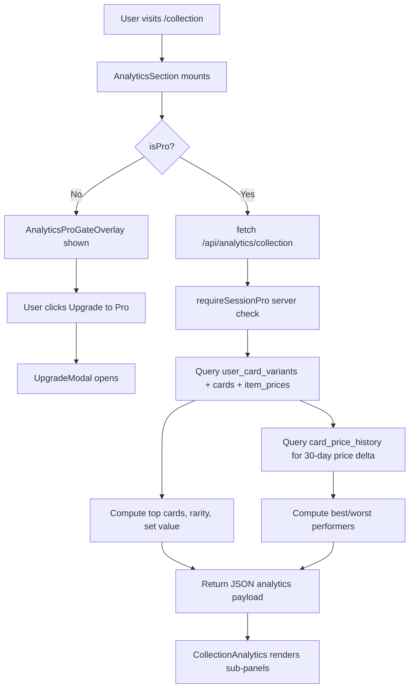
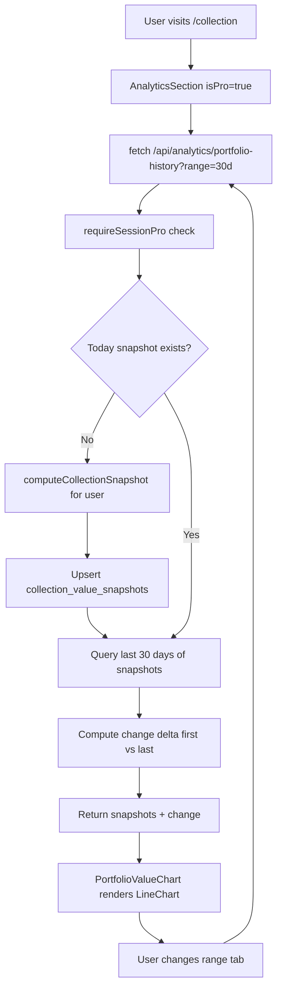

# Pro Analytics — Implementation Plan

**Features:** Advanced Collection Analytics + Portfolio Value Over Time  
**Tier:** Pro-only (`tier === 'pro'`)  
**Stack:** Next.js 14, Supabase, TypeScript, Tailwind CSS, Recharts v3.8.1  
**Status:** Planning — not yet implemented

---

## Table of Contents

1. [Overview & Goals](#overview--goals)
2. [Database Schema Changes](#database-schema-changes)
3. [API Routes](#api-routes)
4. [Component Tree](#component-tree)
5. [Pro-Gating Strategy](#pro-gating-strategy)
6. [Integration with Collection Page](#integration-with-collection-page)
7. [Snapshot Strategy (Portfolio History)](#snapshot-strategy-portfolio-history)
8. [Data Flow Diagrams](#data-flow-diagrams)
9. [TypeScript Interfaces](#typescript-interfaces)
10. [Implementation Steps (Ordered)](#implementation-steps-ordered)

---

## Overview & Goals

### Feature 1 — Advanced Collection Analytics

Displays server-computed insights about a user's owned cards:

| Sub-feature | Description |
|---|---|
| **Top Valuable Cards** | Top 10 most valuable owned cards (name, set, price, quantity) |
| **Rarity Breakdown** | Bar chart: rarity → card count + total value |
| **Value by Set** | Horizontal bar chart: set name → total owned value |
| **Best Performers** | Top 5 cards with highest price gain (%) in last 30 days |
| **Worst Performers** | Top 5 cards with highest price drop (%) in last 30 days |

### Feature 2 — Portfolio Value Over Time

A line chart showing how the user's total collection value has changed day-by-day. Backed by a `collection_value_snapshots` table. The chart uses the same Recharts `LineChart` + `ResponsiveContainer` pattern as `PriceChart.tsx`.

| Range | Availability |
|---|---|
| Today's value | Free (already shown in stats row) |
| 7 / 30 / 90 / 365-day chart | **Pro only** |

> **Note:** `TIER_LIMITS.PORTFOLIO_HISTORY_DAYS` already exists in `lib/tierLimits.ts` (`free: 0, pro: 365`), confirming this was architecturally planned.

---

## Database Schema Changes

### New Table: `collection_value_snapshots`

**Purpose:** Stores one row per user per day recording the total EUR value of their collection. Written by a snapshot trigger (lazy on visit + optional nightly cron).

```sql
-- ============================================================
-- Lumidex — Migration: collection_value_snapshots
-- Purpose: Stores daily collection value snapshots for
--          the Portfolio Value Over Time pro feature.
-- Run once in Supabase SQL editor.
-- ============================================================

CREATE TABLE IF NOT EXISTS public.collection_value_snapshots (
  id              uuid         PRIMARY KEY DEFAULT gen_random_uuid(),
  user_id         uuid         NOT NULL REFERENCES public.users(id) ON DELETE CASCADE,

  -- Truncated to calendar day (UTC); used as the unique key per user/day
  snapshot_date   date         NOT NULL DEFAULT current_date,

  -- Total portfolio value in EUR at time of snapshot
  total_value_eur numeric(12, 2) NOT NULL DEFAULT 0,

  -- Supporting metrics stored alongside value for potential future use
  card_count      integer      NOT NULL DEFAULT 0,  -- distinct card variants owned (quantity > 0)
  set_count       integer      NOT NULL DEFAULT 0,  -- distinct sets with at least one owned card

  created_at      timestamptz  NOT NULL DEFAULT now(),

  -- One snapshot per user per calendar day
  CONSTRAINT collection_value_snapshots_user_date_key UNIQUE (user_id, snapshot_date)
);

-- ── Indexes ─────────────────────────────────────────────────────────────────
-- Primary lookup: history for a user ordered newest first
CREATE INDEX IF NOT EXISTS cvs_user_date_idx
  ON public.collection_value_snapshots (user_id, snapshot_date DESC);

-- ── Row Level Security ────────────────────────────────────────────────────
ALTER TABLE public.collection_value_snapshots ENABLE ROW LEVEL SECURITY;

-- Users can read their own snapshots only
CREATE POLICY "Users can read own snapshots"
  ON public.collection_value_snapshots
  FOR SELECT
  USING (auth.uid() = user_id);

-- Only the service role can write (snapshot endpoint uses supabaseAdmin)
CREATE POLICY "Service role manages snapshots"
  ON public.collection_value_snapshots
  FOR ALL
  USING (auth.role() = 'service_role')
  WITH CHECK (auth.role() = 'service_role');

-- ── Comments ──────────────────────────────────────────────────────────────
COMMENT ON TABLE public.collection_value_snapshots IS
  'Daily collection value snapshots for Pro users. One row per (user_id, snapshot_date). Written by /api/analytics/portfolio-snapshot or the nightly cron.';

COMMENT ON COLUMN public.collection_value_snapshots.total_value_eur IS
  'Sum of (item_prices.price × user_card_variants.quantity) for all owned cards with a known normal-variant EUR price.';

COMMENT ON COLUMN public.collection_value_snapshots.snapshot_date IS
  'Calendar date (UTC) of the snapshot. Used as the unique key — only one snapshot per user per day.';
```

**No other table changes are needed.** All analytics data is computed at query time from existing tables:
- `user_card_variants` — what the user owns
- `cards` — card metadata (name, rarity, set_id, tcggo_id)
- `item_prices` — current prices (item_id = tcggo_id::text, item_type='single', variant='normal')
- `card_price_history` — historical prices (for best/worst performers)
- `sets` — set names

---

## API Routes

### Route Overview

| Method | Path | Auth | Pro-gated | Purpose |
|---|---|---|---|---|
| `GET` | `/api/analytics/collection` | ✅ required | ✅ Pro only | Full collection analytics |
| `GET` | `/api/analytics/portfolio-history` | ✅ required | ✅ Pro only | Portfolio value snapshots |
| `POST` | `/api/analytics/portfolio-snapshot` | ✅ required | ✅ Pro only | Create/refresh today's snapshot |
| `POST` | `/api/cron/portfolio-snapshot` | cron secret | ❌ internal | Nightly batch snapshot for all Pro users |

---

### `GET /api/analytics/collection`

**File:** `app/api/analytics/collection/route.ts`

**Query parameters:** None (user is inferred from session)

**Response shape:**
```jsonc
{
  "topCards": [
    {
      "cardId": "uuid",
      "name": "Charizard ex",
      "setName": "Obsidian Flames",
      "setId": "sv3",
      "rarity": "Double Rare",
      "imageUrl": "https://...",
      "priceEur": 42.50,
      "quantity": 2,
      "totalValueEur": 85.00
    }
    // ... up to 10 entries
  ],
  "rarityBreakdown": [
    { "rarity": "Common",      "cardCount": 312, "totalValueEur": 45.20 },
    { "rarity": "Uncommon",    "cardCount": 124, "totalValueEur": 28.10 },
    { "rarity": "Rare",        "cardCount":  48, "totalValueEur": 210.40 },
    { "rarity": "Double Rare", "cardCount":   6, "totalValueEur": 186.00 }
  ],
  "valueBySet": [
    { "setId": "sv3", "setName": "Obsidian Flames", "cardCount": 87, "totalValueEur": 312.40 }
    // ... all sets
  ],
  "bestPerformers": [
    {
      "cardId": "uuid",
      "name": "Umbreon ex",
      "setName": "Scarlet & Violet 151",
      "priceEur": 35.00,
      "priceEur30dAgo": 18.00,
      "changePercent": 94.4
    }
  ],
  "worstPerformers": [
    {
      "cardId": "uuid",
      "name": "Pidgeot ex",
      "setName": "Obsidian Flames",
      "priceEur": 2.10,
      "priceEur30dAgo": 6.50,
      "changePercent": -67.7
    }
  ],
  "currency": "EUR"
}
```

**Implementation logic (server-side):**

```typescript
// app/api/analytics/collection/route.ts
import { NextResponse } from 'next/server'
import { requireSessionPro, ProRequiredError } from '@/lib/subscription'
import { supabaseAdmin } from '@/lib/supabase'

export async function GET() {
  // 1. Auth + Pro check
  let user
  try {
    user = await requireSessionPro()
  } catch (err) {
    if (err instanceof ProRequiredError)
      return NextResponse.json({ error: err.message, code: 'PRO_REQUIRED' }, { status: 402 })
    throw err
  }

  // 2. Fetch all owned card variants with quantity > 0
  //    Join: user_card_variants → cards → item_prices
  const { data: owned } = await supabaseAdmin
    .from('user_card_variants')
    .select(`
      card_id,
      quantity,
      cards (
        id, name, rarity, set_id, tcggo_id, image,
        sets ( name )
      )
    `)
    .eq('user_id', user.id)
    .gt('quantity', 0)

  // 3. Batch-fetch prices for all owned tcggo_ids
  const tcggoIds = [...new Set(owned.map(r => r.cards?.tcggo_id).filter(Boolean).map(String))]
  const { data: prices } = await supabaseAdmin
    .from('item_prices')
    .select('item_id, price')
    .in('item_id', tcggoIds)
    .eq('item_type', 'single')
    .eq('variant', 'normal')
    .not('price', 'is', null)

  const priceMap = new Map(prices.map(p => [p.item_id, p.price]))

  // 4. Build top cards (sorted by totalValueEur desc, limit 10)
  // 5. Build rarity breakdown (group by rarity, sum count + value)
  // 6. Build value by set (group by set_id, sum count + value)
  // 7. Fetch best/worst performers from card_price_history
  //    - Get price 30 days ago for each owned card with a current price
  //    - Compute changePercent, sort, take top 5 each direction
  
  return NextResponse.json({ topCards, rarityBreakdown, valueBySet, bestPerformers, worstPerformers, currency: 'EUR' }, {
    headers: { 'Cache-Control': 'private, max-age=300' }   // 5-min private cache per user
  })
}
```

**Best/Worst Performers sub-query:**
```typescript
// For each cardId with a current price, look up price ~30 days ago in card_price_history
const cardIds = ownedWithPrices.map(r => r.cardId)
const thirtyDaysAgo = new Date(Date.now() - 30 * 24 * 60 * 60 * 1000).toISOString()

const { data: historyRows } = await supabaseAdmin
  .from('card_price_history')
  .select('card_id, price_usd, recorded_at')
  .in('card_id', cardIds)
  .eq('variant_key', 'normal')
  .gte('recorded_at', thirtyDaysAgo)
  .order('recorded_at', { ascending: true })

// Group by card_id, take the oldest row in the 30-day window per card
// (that oldest row is the "30 days ago" reference price)
```

---

### `GET /api/analytics/portfolio-history`

**File:** `app/api/analytics/portfolio-history/route.ts`

**Query parameters:**

| Param | Values | Default |
|---|---|---|
| `range` | `7d` \| `30d` \| `90d` \| `1y` | `30d` |

**Response shape:**
```jsonc
{
  "snapshots": [
    { "date": "2026-03-18", "totalValueEur": 310.20, "cardCount": 428, "setCount": 6 },
    { "date": "2026-03-19", "totalValueEur": 318.50, "cardCount": 429, "setCount": 6 },
    // ...daily entries
  ],
  "change": {
    "valueEur": 87.30,
    "changePercent": 28.1,
    "direction": "up"   // 'up' | 'down' | 'flat'
  },
  "currency": "EUR"
}
```

**Implementation logic:**
```typescript
// 1. requireSessionPro() — 402 if not pro
// 2. Parse range → days integer (7, 30, 90, 365)
// 3. Trigger snapshot for today if missing (upsert today's value inline)
// 4. Query collection_value_snapshots WHERE user_id = user.id
//    AND snapshot_date >= now() - INTERVAL '{days} days'
//    ORDER BY snapshot_date ASC
// 5. Compute change between first and last snapshot
// 6. Return
```

The inline snapshot trigger (step 3) calls the same computation logic as the snapshot endpoint, allowing the chart to always show today's value without a separate API call.

---

### `POST /api/analytics/portfolio-snapshot`

**File:** `app/api/analytics/portfolio-snapshot/route.ts`

**Purpose:** Computes and upserts today's `collection_value_snapshots` row for the authenticated Pro user. Called by the portfolio-history endpoint inline when today's snapshot is missing.

**Response:**
```jsonc
{ "date": "2026-04-17", "totalValueEur": 397.50, "cardCount": 481, "setCount": 8 }
```

**Implementation logic:**
```typescript
// 1. requireSessionPro() — 402 if not pro
// 2. Load all user_card_variants (quantity > 0) for this user
// 3. Batch-fetch item_prices for all tcggo_ids
// 4. Compute totals: totalValueEur, cardCount (distinct cards with qty > 0), setCount
// 5. Upsert into collection_value_snapshots ON CONFLICT (user_id, snapshot_date) DO UPDATE
// 6. Return the snapshot row
```

---

### `POST /api/cron/portfolio-snapshot`

**File:** `app/api/cron/portfolio-snapshot/route.ts`

**Purpose:** Nightly batch job — creates snapshots for all Active Pro users who don't yet have today's snapshot.

**Auth:** Validated by `CRON_SECRET` environment variable (header `x-cron-secret`).

**Vercel cron config** (`vercel.json`):
```json
{
  "crons": [
    {
      "path": "/api/cron/portfolio-snapshot",
      "schedule": "0 2 * * *"
    }
  ]
}
```

**Implementation logic:**
```typescript
// 1. Check x-cron-secret header === process.env.CRON_SECRET
// 2. SELECT user_id FROM user_subscriptions WHERE tier = 'pro'
// 3. Find users where today's snapshot is missing:
//    SELECT user_id FROM user_subscriptions WHERE tier='pro'
//    EXCEPT
//    SELECT user_id FROM collection_value_snapshots WHERE snapshot_date = current_date
// 4. For each user, compute and upsert snapshot (same logic as single-user endpoint)
// 5. Return { processed: N, errors: [] }
```

> **Note:** For large user bases, this should be batched (50 users at a time) to avoid timeout.

---

## Component Tree

```
app/collection/page.tsx
├── [existing: header, stats row, LastActivitySection, search, set grid]
└── <AnalyticsSection userId={user.id} /> ← NEW — placed after set grid

components/analytics/
├── AnalyticsSection.tsx          ← Container; handles pro gate, data fetching & tabs
├── AnalyticsProGateOverlay.tsx   ← Blurred mockup + "Unlock Pro" CTA for free users
├── CollectionAnalytics.tsx       ← Renders all 4 analytics sub-panels
│   ├── TopValuableCards.tsx      ← Table: top 10 cards by owned value
│   ├── RarityBreakdown.tsx       ← Recharts BarChart: rarity buckets
│   ├── ValueBySet.tsx            ← Recharts horizontal BarChart: value per set
│   └── BestWorstPerformers.tsx   ← Two-column card list: gainers + losers
└── PortfolioValueChart.tsx       ← Recharts LineChart: value over time (mirrors PriceChart.tsx)
```

### `AnalyticsSection.tsx`

Top-level coordinator. Reads pro status, fetches data once user is confirmed Pro, passes data down.

```tsx
'use client'

import { useState, useEffect } from 'react'
import { useProGate } from '@/hooks/useProGate'
import { UpgradeModal } from '@/components/upgrade/UpgradeModal'
import AnalyticsProGateOverlay from './AnalyticsProGateOverlay'
import CollectionAnalytics from './CollectionAnalytics'
import PortfolioValueChart from './PortfolioValueChart'
import { Tabs, Tab } from '@/components/ui/Tabs'

export default function AnalyticsSection({ userId }: { userId: string }) {
  const { isPro, isLoading } = useProGate()
  const [showUpgrade, setShowUpgrade] = useState(false)
  const [analyticsData, setAnalyticsData] = useState(null)
  const [portfolioData, setPortfolioData] = useState(null)
  const [isFetching, setIsFetching] = useState(false)

  useEffect(() => {
    if (!isPro) return
    // Fetch both in parallel once Pro is confirmed
    setIsFetching(true)
    Promise.all([
      fetch('/api/analytics/collection').then(r => r.json()),
      fetch('/api/analytics/portfolio-history?range=30d').then(r => r.json()),
    ]).then(([analytics, portfolio]) => {
      setAnalyticsData(analytics)
      setPortfolioData(portfolio)
    }).finally(() => setIsFetching(false))
  }, [isPro])

  if (isLoading) return <AnalyticsSkeleton />

  if (!isPro) {
    return (
      <>
        <AnalyticsProGateOverlay onUpgradeClick={() => setShowUpgrade(true)} />
        <UpgradeModal
          isOpen={showUpgrade}
          onClose={() => setShowUpgrade(false)}
          feature="Advanced Collection Analytics"
        />
      </>
    )
  }

  return (
    <div className="mt-10">
      <div className="flex items-center gap-3 mb-6">
        <h2 className="text-xl font-bold text-primary" style={{ fontFamily: 'var(--font-space-grotesk)' }}>
          Pro Analytics
        </h2>
        <ProBadge size="sm" />
      </div>
      <Tabs>
        <Tab label="Collection Insights">
          <CollectionAnalytics data={analyticsData} isLoading={isFetching} />
        </Tab>
        <Tab label="Portfolio Value">
          <PortfolioValueChart data={portfolioData} isLoading={isFetching} />
        </Tab>
      </Tabs>
    </div>
  )
}
```

### `AnalyticsProGateOverlay.tsx`

Shown to free users in place of the analytics panel. Shows a blurred mockup screenshot behind a glass-morphism card with upgrade CTA. Mirrors the visual style of the 402 blur overlay pattern used in `PriceChart.tsx` for locked ranges.

```tsx
// Blurred background: a static mockup image (or a frozen/blurred copy of the chart)
// Overlaid card: "💎 Pro Feature" heading + feature list + "Upgrade to Pro" button
// Clicking the button fires onUpgradeClick → parent opens UpgradeModal
```

### `TopValuableCards.tsx`

Renders as a responsive table or card list.

| # | Card | Set | Rarity | Price | Qty | Total Value |
|---|---|---|---|---|---|---|
| 1 | Charizard ex | Obsidian Flames | Double Rare | €42.50 | 2 | €85.00 |

### `RarityBreakdown.tsx`

Uses `recharts` `BarChart` with two bars per rarity group: card count (left axis, scaled) + total value (right axis). Same `ResponsiveContainer` wrapper pattern as `PriceChart.tsx`.

### `ValueBySet.tsx`

Horizontal `BarChart`. One bar per set (sets sorted by `totalValueEur` descending). Shows the set name on the Y axis and EUR value on the X axis.

### `BestWorstPerformers.tsx`

Two-column layout (stacks on mobile). Left: green-tinted best performers. Right: red-tinted worst performers. Each entry shows card name, set, current price, old price, and `+X%` / `-X%` badge.

Only shown if `card_price_history` has data (≥30 days of history for owned cards). Falls back to a "Not enough data yet" empty state with a note that price history accumulates over time.

### `PortfolioValueChart.tsx`

Mirrors `PriceChart.tsx` structure:
- `ResponsiveContainer` → `LineChart`
- `XAxis` with date labels
- `YAxis` with EUR values (formatted with `formatPrice`)
- `Tooltip` with EUR value + date
- Range selector tabs above chart: `7d | 30d | 90d | 1y`
- A summary header showing: current value, change in EUR, change in %

```tsx
'use client'
import { LineChart, Line, XAxis, YAxis, CartesianGrid, Tooltip, ResponsiveContainer } from 'recharts'
// range state + onRangeChange → re-fetches /api/analytics/portfolio-history?range={range}
```

---

## Pro-Gating Strategy

### Client-Side (UI layer)

Uses the existing `useProGate()` hook pattern — identical to how `PriceChart.tsx` gates extended ranges:

```tsx
const { isPro, isLoading } = useProGate()

if (isLoading) return <Skeleton />
if (!isPro) return <AnalyticsProGateOverlay onUpgradeClick={...} />
return <AnalyticsContent />
```

**What free users see:**
- The stats row (Sets Tracked, Cards Owned, Collection Value) — unchanged
- Below the set grid: `AnalyticsProGateOverlay` — blurred analytics mockup with "Unlock Pro" CTA
- `UpgradeModal` opens on CTA click, with `feature="Advanced Collection Analytics"` pre-filling the modal copy

### Server-Side (API layer)

All three analytics API routes call `requireSessionPro()` at the top:

```typescript
import { requireSessionPro, ProRequiredError } from '@/lib/subscription'

export async function GET() {
  let user
  try {
    user = await requireSessionPro()
  } catch (err) {
    if (err instanceof ProRequiredError) {
      return NextResponse.json(
        { error: err.message, code: 'PRO_REQUIRED' },
        { status: 402 }
      )
    }
    throw err
  }
  // ... proceed with user.id
}
```

The client-side pro check prevents the API from being called for free users at all, but the server check ensures the API cannot be abused directly.

---

## Integration with Collection Page

### Changes to `app/collection/page.tsx`

1. **Import** `AnalyticsSection` at the top.
2. **Render** `<AnalyticsSection userId={user.id} />` after the collection grid (and after the empty state check — only shown when `userPokemonSets.length > 0`).
3. No changes to existing stats row or set grid.

```tsx
// After the collection grid (filteredSets.map block):
{userPokemonSets.length > 0 && (
  <AnalyticsSection userId={user.id} />
)}
```

**Placement in page structure:**
```
My Collection (header)
├── Summary Stats (Sets Tracked | Cards Owned | Collection Value)
├── Last Activity
├── Search Filter
├── Set Grid (existing)
└── ── Pro Analytics ──────────────────────  ← NEW SECTION
    ├── [Tab: Collection Insights]
    │   ├── Top Valuable Cards
    │   ├── Rarity Breakdown (chart)
    │   ├── Value by Set (chart)
    │   └── Best / Worst Performers
    └── [Tab: Portfolio Value]
        └── PortfolioValueChart (line chart)
```

---

## Snapshot Strategy (Portfolio History)

### Why "lazy on visit" instead of pure cron

Relying solely on a nightly cron means new Pro users have no history until the next morning. The lazy approach fills gaps instantly.

### How it works

```
User visits /collection → AnalyticsSection mounts → isPro = true
  → fetch('/api/analytics/portfolio-history?range=30d')
    → Server: requireSessionPro() ✓
    → Server: Check if today's snapshot exists for user
      → If NO: compute + upsert snapshot inline (same tx as the response)
      → If YES: skip
    → Query last 30 days of snapshots
    → Return { snapshots, change, currency }
```

This means:
- Today's snapshot is always fresh when the page loads
- Historic snapshots (from previous days) are immutable once written
- The `UNIQUE(user_id, snapshot_date)` constraint prevents duplicate snapshots

### Snapshot value computation (shared logic)

```typescript
// lib/analytics.ts — shared between POST snapshot route and portfolio-history route

export async function computeCollectionSnapshot(userId: string) {
  // 1. Get all user_card_variants with quantity > 0
  const { data: variants } = await supabaseAdmin
    .from('user_card_variants')
    .select('card_id, quantity, cards(tcggo_id, set_id)')
    .eq('user_id', userId)
    .gt('quantity', 0)

  const tcggoIds = [...new Set(
    variants.map(v => v.cards?.tcggo_id).filter(Boolean).map(String)
  )]

  // 2. Batch-fetch current prices
  const { data: prices } = await supabaseAdmin
    .from('item_prices')
    .select('item_id, price')
    .in('item_id', tcggoIds)
    .eq('item_type', 'single')
    .eq('variant', 'normal')
    .not('price', 'is', null)

  const priceMap = new Map(prices.map(p => [p.item_id, p.price as number]))

  // 3. Aggregate
  let totalValueEur = 0
  const uniqueCards = new Set<string>()
  const uniqueSets  = new Set<string>()

  for (const v of variants) {
    uniqueCards.add(v.card_id)
    if (v.cards?.set_id) uniqueSets.add(v.cards.set_id)
    const tcggoId = v.cards?.tcggo_id ? String(v.cards.tcggo_id) : null
    if (tcggoId && priceMap.has(tcggoId)) {
      totalValueEur += (priceMap.get(tcggoId)! * v.quantity)
    }
  }

  return {
    totalValueEur: Math.round(totalValueEur * 100) / 100,
    cardCount: uniqueCards.size,
    setCount:  uniqueSets.size,
  }
}
```

### Nightly Cron (Optional Enhancement)

Add `vercel.json` to pre-compute snapshots for all Pro users at 02:00 UTC:

```json
{
  "crons": [
    {
      "path": "/api/cron/portfolio-snapshot",
      "schedule": "0 2 * * *"
    }
  ]
}
```

The cron endpoint uses `CRON_SECRET` env var (same pattern as other Vercel cron implementations). It finds all Pro users without today's snapshot, then calls `computeCollectionSnapshot()` for each.

---

## Data Flow Diagrams

### Feature 1 — Analytics Data Flow



### Feature 2 — Portfolio History Data Flow



---

## TypeScript Interfaces

Add to `types/index.ts` or a new `types/analytics.ts`:

```typescript
// types/analytics.ts

export interface TopCard {
  cardId:        string
  name:          string
  setName:       string
  setId:         string
  rarity:        string | null
  imageUrl:      string | null
  priceEur:      number
  quantity:      number
  totalValueEur: number
}

export interface RarityBucket {
  rarity:        string
  cardCount:     number
  totalValueEur: number
}

export interface SetValueEntry {
  setId:         string
  setName:       string
  cardCount:     number
  totalValueEur: number
}

export interface PerformerCard {
  cardId:          string
  name:            string
  setName:         string
  setId:           string
  priceEur:        number
  priceEur30dAgo:  number
  changePercent:   number
}

export interface CollectionAnalyticsPayload {
  topCards:        TopCard[]
  rarityBreakdown: RarityBucket[]
  valueBySet:      SetValueEntry[]
  bestPerformers:  PerformerCard[]
  worstPerformers: PerformerCard[]
  currency:        'EUR'
}

export interface PortfolioSnapshot {
  date:          string   // ISO date "2026-04-17"
  totalValueEur: number
  cardCount:     number
  setCount:      number
}

export interface PortfolioHistoryPayload {
  snapshots: PortfolioSnapshot[]
  change: {
    valueEur:      number
    changePercent: number
    direction:     'up' | 'down' | 'flat'
  }
  currency: 'EUR'
}
```

---

## Implementation Steps (Ordered)

### Phase 1 — Database & Infrastructure

- [ ] **1.1** Write `database/migration_collection_value_snapshots.sql` with the SQL from this plan
- [ ] **1.2** Run migration in Supabase SQL editor
- [ ] **1.3** Add `lib/analytics.ts` with shared `computeCollectionSnapshot()` helper
- [ ] **1.4** Add `types/analytics.ts` with interfaces above

### Phase 2 — API Routes

- [ ] **2.1** Create `app/api/analytics/portfolio-snapshot/route.ts` (POST — creates today's snapshot)
- [ ] **2.2** Create `app/api/analytics/portfolio-history/route.ts` (GET — returns snapshot time-series)
- [ ] **2.3** Create `app/api/analytics/collection/route.ts` (GET — full analytics payload)
- [ ] **2.4** Create `app/api/cron/portfolio-snapshot/route.ts` (POST — nightly batch)
- [ ] **2.5** Add `vercel.json` with cron schedule (or confirm existing `vercel.json`)

### Phase 3 — Components

- [ ] **3.1** Create `components/analytics/PortfolioValueChart.tsx` (recharts LineChart, range tabs)
- [ ] **3.2** Create `components/analytics/TopValuableCards.tsx` (table/list)
- [ ] **3.3** Create `components/analytics/RarityBreakdown.tsx` (recharts BarChart)
- [ ] **3.4** Create `components/analytics/ValueBySet.tsx` (recharts horizontal BarChart)
- [ ] **3.5** Create `components/analytics/BestWorstPerformers.tsx` (two-column list)
- [ ] **3.6** Create `components/analytics/CollectionAnalytics.tsx` (assembles 3.2–3.5)
- [ ] **3.7** Create `components/analytics/AnalyticsProGateOverlay.tsx` (blurred lock overlay)
- [ ] **3.8** Create `components/analytics/AnalyticsSection.tsx` (top-level container with pro gate, tabs, data fetching)

### Phase 4 — Integration

- [ ] **4.1** Import and render `<AnalyticsSection userId={user.id} />` in `app/collection/page.tsx`
- [ ] **4.2** Verify existing `ui/Tabs.tsx` component supports the tab layout needed (or extend it)

### Phase 5 — QA & Polish

- [ ] **5.1** Test free user sees `AnalyticsProGateOverlay`, upgrade modal opens correctly
- [ ] **5.2** Test Pro user: analytics data displays, charts render, range changes work
- [ ] **5.3** Test snapshot creation: first visit creates a snapshot, second visit skips
- [ ] **5.4** Test API 402 responses when calling analytics routes as free user directly
- [ ] **5.5** Empty states: user with no priced cards sees graceful empty state (not NaN or blank chart)
- [ ] **5.6** Currency: all displayed values go through `fmtCardPrice({ eur, usd: null }, preferredCurrency)`
- [ ] **5.7** Loading skeletons for all analytics panels

---

## Key Design Decisions & Rationale

| Decision | Rationale |
|---|---|
| **Server-side computation for analytics** | Complex joins across 4+ tables, user-specific — results cannot be cached publicly; avoids sending raw card/price data to client |
| **Lazy snapshot on visit** | Ensures Pro users see today's portfolio value immediately without waiting for the cron job; no stale data on first use |
| **Snapshot value uses `item_prices` not `card_price_history`** | `item_prices` has the authoritative current prices; `card_price_history` is for historical lookups (best/worst performers only) |
| **5-minute private cache on collection API** | `Cache-Control: private, max-age=300` — user-specific data should not be shared in CDN caches, but 5 min avoids hammering the DB on rapid re-navigations |
| **Recharts `LineChart` for portfolio** | Same library already in use for `PriceChart.tsx`; no additional bundle cost; consistent visual language |
| **Pro gate at both client + server** | Client gate = UX (shows upgrade prompt); Server gate = security (API cannot be abused by direct calls) |
| **`UNIQUE(user_id, snapshot_date)`** | Prevents duplicate snapshots from concurrent requests or cron + lazy race; allows safe `ON CONFLICT DO UPDATE` upserts |
| **`total_value_eur` only (no USD)** | All prices stored in EUR via `item_prices`; currency formatting applied at display time using `fmtCardPrice` with user's `preferred_currency` |
