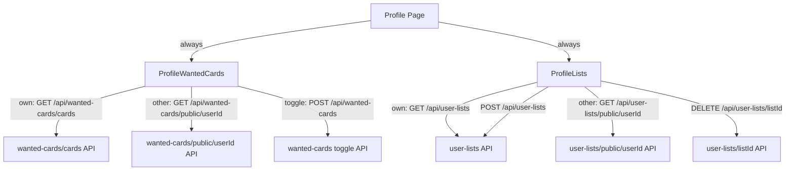

# Plan: Profile Lists & Wanted Cards + Navbar Tweaks

## Overview

Three distinct changes:
1. Remove "Lists" from navbar; change "Wanted" to "Wanted Board" pointing at `/wanted-board`
2. Add a **Lists** section to the profile page
3. Add a **Wanted Cards** section to the profile page (own profile only)

---

## 1. Navbar Changes — `components/Navbar.tsx`

Two one-line modifications on lines 124–125:

| Before | After |
|--------|-------|
| `<Link href="/wanted">Wanted</Link>` | `<Link href="/wanted-board">Wanted Board</Link>` |
| `<Link href="/lists">Lists</Link>` | _(remove entirely)_ |

---

## 2. New API Route — `app/api/user-lists/public/[userId]/route.ts`

**Purpose:** Return the *public* lists for any user by their UUID. No auth required (public data).

```
GET /api/user-lists/public/[userId]
Response: { lists: UserCardList[] }   // only is_public === true rows
```

Implementation mirrors the existing `GET /api/user-lists` route but:
- Uses `userId` from the URL param instead of the authenticated user
- Adds `.eq('is_public', true)` filter
- Does not require an authenticated session

---

## 3. New Component — `components/profile/ProfileLists.tsx`

**Props:**
```ts
{
  userId: string
  isOwnProfile: boolean
  displayName: string
}
```

**Behaviour:**
- **Own profile:** fetches from `GET /api/user-lists` (all lists, public + private).
  - Shows a "+ New List" button that reveals an inline create form (name input).
  - Each card has a delete button (trash icon, hover-reveal, calls `DELETE /api/user-lists/[listId]`).
  - Clicking a list navigates to `/lists/[listId]`.
- **Other profiles:** fetches from `GET /api/user-lists/public/[userId]` (public only).
  - No create/delete controls.
  - Clicking a list navigates to `/lists/[listId]`.
- **Empty own profile state:** "You have no lists yet" + CTA button.
- **Empty other profile state:** "No public lists yet".

**UI pattern:** Card grid matching the existing `/lists` page style (preview thumbnails + name badge + card count + public/private pill). Reuse the same markup patterns.

---

## 4. New API Route — `app/api/wanted-cards/public/[userId]/route.ts`

**Purpose:** Return all wanted cards for any user by UUID — public data, no auth required.

```
GET /api/wanted-cards/public/[userId]
Response: { cards: PokemonCard[] }
```

Implementation mirrors the existing [`GET /api/wanted-cards/cards`](app/api/wanted-cards/cards/route.ts) route but:
- Uses `userId` from the URL param instead of the authenticated user
- No session required (public endpoint)

---

## 5. New Component — `components/profile/ProfileWantedCards.tsx`

**Props:**
```ts
{
  userId: string
  isOwnProfile: boolean
  displayName: string
}
```

**Behaviour:**
- **Own profile:** fetches from `GET /api/wanted-cards/cards`.
  - Supports un-starring: optimistic removal when the user un-stars a card.
  - "View all X wanted cards →" link to `/wanted`.
- **Other profiles:** fetches from `GET /api/wanted-cards/public/[userId]` (public, no auth required).
  - Read-only — no un-star control shown.
  - "View all" link still present (directs to their `/wanted` page — same URL pattern since `/wanted` is auth-gated, this link is omitted for other profiles; instead just show count).
- **All profiles:** compact strip of card thumbnails (72×100 px tiles, max ~8 visible, labelled with "X cards wanted").
- **Empty state:** "No wanted cards yet" placeholder.

---

## 6. Profile Page Wiring — `app/profile/[id]/page.tsx`

### New imports
```ts
import ProfileLists       from '@/components/profile/ProfileLists'
import ProfileWantedCards from '@/components/profile/ProfileWantedCards'
```

### New sections (inserted after the Achievements section, before Friends section)

```
Achievements  ← existing
──────────────────────────
[NEW] Wanted Cards  ← all profiles
[NEW] Lists         ← all profiles (own = full CRUD, other = public view)
──────────────────────────
Friends       ← existing
Sets          ← existing
```

Both new components handle their own data fetching internally to keep the profile page lean.

---

## Data Flow Diagram



---

## Files to Create / Modify

| Action | File |
|--------|------|
| **Modify** | `components/Navbar.tsx` |
| **Create** | `app/api/user-lists/public/[userId]/route.ts` |
| **Create** | `app/api/wanted-cards/public/[userId]/route.ts` |
| **Create** | `components/profile/ProfileLists.tsx` |
| **Create** | `components/profile/ProfileWantedCards.tsx` |
| **Modify** | `app/profile/[id]/page.tsx` |

No database migrations needed — all data is already available via existing tables (`user_card_lists`, `wanted_cards`).
