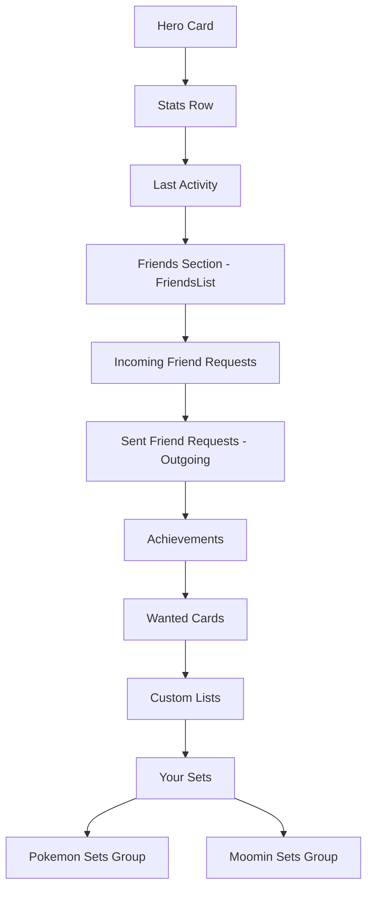

# Profile Page Improvements Plan

## Overview

Three targeted improvements to [`app/profile/[id]/page.tsx`](../app/profile/[id]/page.tsx):

1. **New Achievements** — TCG-specific + general-collecting achievements
2. **Friends Section Reorder** — Move `FriendsList` above `FriendRequests`
3. **Sets Split by TCG** — Group the "Your Sets" section by game

---

## 1. New Achievements

### Current State

The existing 36 achievements in [`lib/achievements.ts`](../lib/achievements.ts) and DB are all **game-agnostic**. Categories:
- Collection Size, Unique Cards, Sets Tracked, Set Completion, Duplicates, Wanted List, Sealed Products, Social, Profile

The only Pokémon-flavoured name is `"Living Pokédex"` (complete 50 sets) — it stays as-is.

---

### New `UserStats` Fields Required

Extend the [`UserStats`](../lib/achievements.ts:12) interface with:

```ts
/** Number of graded cards in user_graded_cards */
gradedCardCount: number
/** Sets tracked where sets.game = 'pokemon' */
pokemonSetsTracked: number
/** Completed sets where sets.game = 'pokemon' */
pokemonSetsCompleted: number
/** Sets tracked where sets.game = 'moomin' */
moominSetsTracked: number
/** Completed sets where sets.game = 'moomin' */
moominSetsCompleted: number
/** Distinct count of games the user has at least one set in */
gamesTracked: number
/** Number of custom lists in user_card_lists */
listCount: number
```

### Queries to Add in `getUserStats()`

| New Field | Query Strategy |
|---|---|
| `gradedCardCount` | `SELECT count(*) FROM user_graded_cards WHERE user_id = $1` (count: 'exact', head: true) |
| `pokemonSetsTracked` | Filter already-fetched `setsData` joined against a per-game set lookup — OR a separate `.from('user_sets').select('set_id').eq('user_id', userId)` joined via `sets` game filter. See implementation note below. |
| `pokemonSetsCompleted` | Derived from existing `setsInfo` + `cardCounts` filtered to `game = 'pokemon'` |
| `moominSetsTracked` | Same as pokemonSetsTracked pattern, game = 'moomin' |
| `moominSetsCompleted` | Same as pokemonSetsCompleted pattern, game = 'moomin' |
| `gamesTracked` | Derive from the `setsInfo` results: `new Set(setsInfo.map(s => s.game)).size` |
| `listCount` | `SELECT count(*) FROM user_card_lists WHERE user_id = $1` |

**Implementation note for per-game set counts:** The existing `getUserStats()` already fetches `sets` rows for all `userSetIds`. Those rows include a `game` field (added by `migration_multi_game_support.sql`). The query should be updated to also select `game`:

```ts
client.from('sets').select('set_id, "setComplete", "setTotal", game').in('set_id', userSetIds)
```

Then `pokemonSetsTracked`, `moominSetsTracked`, etc. are all derivable in-memory from that result — **no extra DB queries**.

---

### New Achievement Categories

#### 🟡 Pokémon Trainer (Pokémon-specific)

| Name | Condition | Icon | Description |
|---|---|---|---|
| Pokémon Trainer | pokemonSetsTracked ≥ 1 | 🎮 | Start tracking your first Pokémon set |
| Gym Leader | pokemonSetsCompleted ≥ 1 | 🥊 | Complete your first Pokémon set |
| Elite Four | pokemonSetsCompleted ≥ 4 | 🏅 | Complete 4 Pokémon sets |
| Champion | pokemonSetsCompleted ≥ 10 | 🏆 | Defeat the Champion — complete 10 Pokémon sets |
| Pokémon Master | pokemonSetsCompleted ≥ 25 | 👑 | Master them all — complete 25 Pokémon sets |

#### 🌿 Moomin Collector (Moomin-specific)

| Name | Condition | Icon | Description |
|---|---|---|---|
| Moomin Explorer | moominSetsTracked ≥ 1 | 🌿 | Start tracking your first Moomin set |
| Valley Dweller | moominSetsCompleted ≥ 1 | 🏡 | Complete your first Moomin set |
| Moomin Collector | moominSetsCompleted ≥ 3 | 🌊 | Complete 3 Moomin sets |

#### 🔬 Graded Cards

| Name | Condition | Icon | Description |
|---|---|---|---|
| Grader's Apprentice | gradedCardCount ≥ 1 | 🔬 | Submit your first card for grading |
| Graded Investor | gradedCardCount ≥ 10 | 💰 | Build a graded collection of 10 slabs |
| Slab Master | gradedCardCount ≥ 50 | 🏛️ | Accumulate 50 graded slabs |

#### 🌍 Multi-Game / General Collector

| Name | Condition | Icon | Description |
|---|---|---|---|
| World Collector | gamesTracked ≥ 2 | 🌍 | Collect across 2 different TCGs |
| List Maker | listCount ≥ 1 | 📝 | Create your first custom list |
| Curator | listCount ≥ 5 | 🖼️ | Curate 5 custom lists |

---

### Total New Achievements: 13

Combined with the existing 36, the new total is **49 achievements**.

---

### Files to Change

| File | Change |
|---|---|
| [`lib/achievements.ts`](../lib/achievements.ts) | Extend `UserStats`, update `getUserStats()`, add 13 new `achievementChecks` entries |
| [`app/profile/[id]/page.tsx`](../app/profile/[id]/page.tsx) | Add 4 new entries to `ACHIEVEMENT_CATEGORIES` constant |
| [`locales/en.ts`](../locales/en.ts) | Add 4 new `achieve_cat_*` keys |
| [`locales/nb.ts`](../locales/nb.ts) | Add 4 new `achieve_cat_*` keys (Norwegian) |
| [`database/migration_seed_achievements_v3.sql`](../database/migration_seed_achievements_v3.sql) | **New file** — INSERT 13 new achievement rows |

### New i18n Keys (locales/en.ts)

```ts
achieve_cat_pokemon:  'Pokémon Trainer',
achieve_cat_moomin:   'Moomin Collector',
achieve_cat_graded:   'Graded Cards',
achieve_cat_general:  'General Collecting',
```

### New ACHIEVEMENT_CATEGORIES entries (profile page)

```ts
{ labelKey: 'achieve_cat_pokemon',  names: ['Pokémon Trainer', 'Gym Leader', 'Elite Four', 'Champion', 'Pokémon Master'] },
{ labelKey: 'achieve_cat_moomin',   names: ['Moomin Explorer', 'Valley Dweller', 'Moomin Collector'] },
{ labelKey: 'achieve_cat_graded',   names: ['Grader\'s Apprentice', 'Graded Investor', 'Slab Master'] },
{ labelKey: 'achieve_cat_general',  names: ['World Collector', 'List Maker', 'Curator'] },
```

---

## 2. Friends Section Reorder

### Current Section Order (inside `!isPrivate` block)

```
1. Stats Row
2. <LastActivitySection />          line 679
3. <FriendRequests /> (incoming)    line 682
4. <OutgoingRequests /> (sent)      line 690
5. Achievements Section             line 694
6. <ProfileWantedCards />           line 795
7. <ProfileLists />                 line 802
8. <FriendsList /> — Friends Sec.   line 809  ← needs to move up
9. Sets Section                     line 838
```

### Desired Section Order

```
1. Stats Row
2. <LastActivitySection />
3. <FriendsList /> — Friends Sec.  ← moved here (under Last Activity)
4. <FriendRequests /> (incoming)   ← sent above OutgoingRequests
5. <OutgoingRequests /> (sent)     ← FriendsList now above this
6. Achievements Section
7. <ProfileWantedCards />
8. <ProfileLists />
9. Sets Section (split by TCG)
```

### Change Required

In [`app/profile/[id]/page.tsx`](../app/profile/[id]/page.tsx), move the entire `<section>` block (lines 809–836) that contains the `<FriendsList />` to immediately after `<LastActivitySection />` (line 679), before the `<FriendRequests />` block.

No logic changes — pure JSX reorder.

---

## 3. "Your Sets" Split by TCG

### Current State

The sets query at line 163 does **not** fetch the `game` field:

```ts
supabase
  .from('sets')
  .select('id:set_id, name, series, total:setTotal, setComplete, release_date, logo_url, symbol_url, created_at')
  .in('set_id', userSetIds)
```

The sets section renders a single flat grid of all `displaySets`.

### Required Changes

#### Step 1 — Add `game` to the sets query

```ts
supabase
  .from('sets')
  .select('id:set_id, name, series, total:setTotal, setComplete, release_date, logo_url, symbol_url, created_at, game')
  .in('set_id', userSetIds)
```

`game` is already on the `TcgSet` / `PokemonSet` type (added by `migration_multi_game_support.sql`).

#### Step 2 — Group displaySets by game

Replace the single `displaySets` array with a grouped structure:

```ts
import { GAMES, ALL_GAME_SLUGS } from '@/lib/games'

// After existing sort...
const setsByGame = ALL_GAME_SLUGS
  .map(slug => ({
    slug,
    displayName: GAMES[slug].displayName,
    logoUrl: GAMES[slug].logoUrl,
    sets: displaySets.filter(s => s.game === slug),
  }))
  .filter(g => g.sets.length > 0)
```

#### Step 3 — Render per-TCG sections

Replace the flat grid with a loop over `setsByGame`:

```tsx
{setsByGame.map(({ slug, displayName, logoUrl, sets }) => (
  <div key={slug} className="mb-8">
    {/* Game header — logo + name */}
    <div className="flex items-center gap-2 mb-3">
      
      <h3 className="text-sm font-semibold text-secondary uppercase tracking-wide">
        {displayName}
      </h3>
      <span className="text-xs text-muted">({sets.length})</span>
    </div>
    {/* Sets grid — same SetCard component */}
    <div className="grid grid-cols-1 md:grid-cols-2 lg:grid-cols-3 xl:grid-cols-4 gap-5">
      {sets.map(set => (
        <SetCard key={set.id} set={set} progress={setProgressMap[set.id]} />
      ))}
    </div>
  </div>
))}
```

If the user only has sets from one game, the header is still shown for consistency (and future-proofing as they add more TCGs).

The empty-state fallback (no sets at all) stays unchanged.

---

## Section Layout Diagram



---

## Files Changed Summary

| File | Change Type | Description |
|---|---|---|
| [`lib/achievements.ts`](../lib/achievements.ts) | Modified | Extend UserStats, getUserStats queries, 13 new achievementChecks |
| [`app/profile/[id]/page.tsx`](../app/profile/[id]/page.tsx) | Modified | FriendsList reorder, game field in query, per-TCG sets grouping, new ACHIEVEMENT_CATEGORIES |
| [`locales/en.ts`](../locales/en.ts) | Modified | 4 new achieve_cat_* keys |
| [`locales/nb.ts`](../locales/nb.ts) | Modified | 4 new achieve_cat_* keys in Norwegian |
| [`database/migration_seed_achievements_v3.sql`](../database/migration_seed_achievements_v3.sql) | New file | INSERT 13 new achievement rows, safe ON CONFLICT DO NOTHING |

No schema migrations needed (all new data fits in the existing `achievements` table; `game` column on `sets` already exists from `migration_multi_game_support.sql`).
