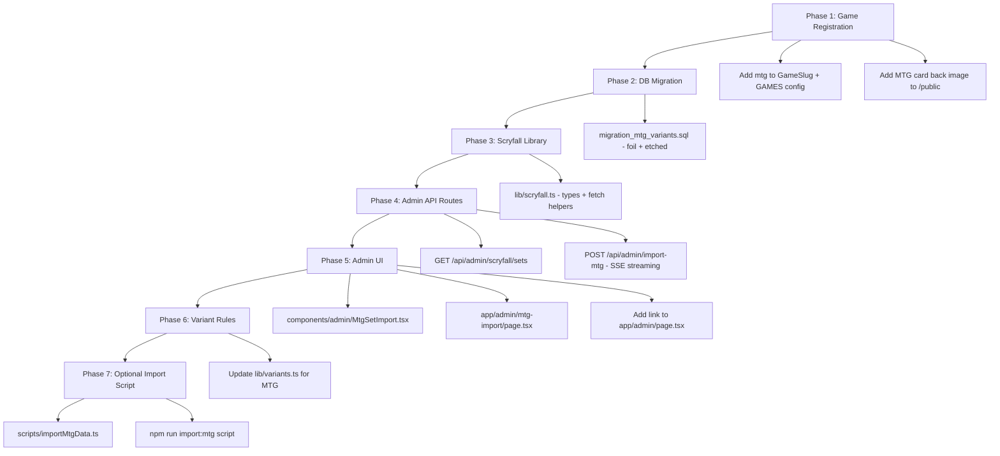

# Scryfall MTG Integration Plan
## Lumidex: Adding Magic: The Gathering via the Scryfall API

**Created:** 2026-08-18
**Status:** Ready for implementation review
**API docs:** https://scryfall.com/docs/api
**Scope:** Standard sets + Masters sets (expansion + core + masters); start with 20 newest per category

---

## 0. Scryfall API Overview

Scryfall is the de-facto MTG card database. Key facts relevant to this integration:

| Property | Value |
|---|---|
| Auth | None required (public API) |
| Rate limit | Max 10 req/s; Scryfall asks for 50–100 ms between requests |
| Sets endpoint | `GET https://api.scryfall.com/sets` → ~800 MTG sets |
| Cards (paginated) | `GET /cards/search?q=set:{code}&order=collector_number` (175/page) |
| Bulk data dumps | `GET /bulk-data` → single JSON file of **all** cards (~100 MB) |
| Images | Free CDN URLs embedded in card object (`image_uris.normal`, `.large`, `.png`) |
| Double-faced cards | `card_faces[]` array, each face has its own `image_uris` |

### Scryfall set object (relevant fields)
```json
{
  "code": "dsk",
  "name": "Duskmourn: House of Horror",
  "released_at": "2024-09-27",
  "card_count": 276,
  "set_type": "expansion",
  "icon_svg_uri": "https://svgs.scryfall.io/sets/dsk.svg"
}
```

### Scryfall card object (relevant fields)
```json
{
  "id": "uuid-scryfall",
  "name": "Monstrous Rage",
  "set": "dsk",
  "collector_number": "145",
  "rarity": "common",
  "artist": "Justine Cruz",
  "type_line": "Instant",
  "image_uris": {
    "normal": "https://cards.scryfall.io/normal/front/…/uuid.jpg",
    "large": "https://cards.scryfall.io/large/front/…/uuid.jpg",
    "png":   "https://cards.scryfall.io/png/front/…/uuid.png"
  },
  "finishes": ["nonfoil", "foil"],
  "card_faces": null
}
```

For **double-faced cards** (DFCs), `image_uris` is null at root level; images live in `card_faces[0].image_uris`.

---

## 1. Data Model Mapping

### 1.1 Scryfall → Lumidex `sets` table

| Scryfall field | Lumidex column | Notes |
|---|---|---|
| `code` | `api_set_id` | Already exists; stores the 3–5 char set code e.g. `"dsk"` |
| `name` | `name` | Full set name |
| `name` (series grouping) | `series` | Derived by set_type / block logic (see §4) |
| `released_at` | `release_date` | ISO date |
| `card_count` | `setTotal` & `setComplete` | Same value initially |
| `icon_svg_uri` | `symbol_url` | SVG set icon |
| *(set logo not in Scryfall)* | `logo_url` | Left null; admin can upload manually |
| `'mtg'` (hardcoded) | `game` | New game slug |
| `'en'` (hardcoded) | `language` | English; Japanese/other languages import as separate sets |

**`set_id` generation:** `mtg-{code}` → e.g. `"mtg-dsk"`. Deterministic and collision-free.

### 1.2 Scryfall → Lumidex `cards` table

| Scryfall field | Lumidex column | Notes |
|---|---|---|
| `id` (Scryfall UUID) | `api_id` | Reuses existing `api_id text` column |
| `name` | `name` | |
| `set` | `set_id` → `"mtg-{code}"` | Derived |
| `collector_number` | `number` | e.g. `"145"`, `"265★"` |
| `rarity` | `rarity` | Normalised to Title Case |
| `artist` | `artist` | |
| `type_line` | `type` | e.g. `"Creature — Dragon"` |
| `image_uris.normal` | `image` | Scryfall CDN URL; can be mirrored to R2 later |
| `card_faces[0].image_uris.normal` | `image` | For DFCs — front face image |
| *(hp not applicable)* | `hp` | Left null |
| *(subtypes parsed from type_line)* | `subtypes` | Optional; can be parsed from type_line |

---

## 2. New Game Slug: `mtg`

### 2.1 `lib/games.ts` changes

Add `'mtg'` to [`GameSlug`](lib/games.ts:1) union and [`GAMES`](lib/games.ts:18) record:

```typescript
export type GameSlug = 'pokemon' | 'moomin' | 'mtg';

GAMES.mtg = {
  slug: 'mtg',
  displayName: 'Magic: The Gathering',
  cardBackImage: '/mtg_card_backside.jpg',
  defaultLanguage: 'en',
  logoUrl: '/images/games/mtg-logo.png',
  description: 'Collect cards from every Magic: The Gathering set — from Alpha to the latest expansion.',
}
```

A placeholder card back image should be placed at `public/mtg_card_backside.jpg` (standard MTG card back is freely available).

### 2.2 `GenericCardImport` filter update

[`components/admin/GenericCardImport.tsx:50`](components/admin/GenericCardImport.tsx:50) filters out `'pokemon'`. With `'mtg'` added, it will automatically appear in the generic importer's game picker. However, the dedicated Scryfall import tool (§5) is the recommended path for MTG.

---

## 3. Database Migrations

### 3.1 MTG Variants

MTG cards have three finish types that map to Lumidex variants:

| Scryfall `finishes` value | Variant key | Name | Color |
|---|---|---|---|
| `"nonfoil"` | `normal` | Normal | green (already exists) |
| `"foil"` | `foil` | Foil | blue |
| `"etched"` | `etched` | Etched Foil | teal |

**Migration file:** `database/migration_mtg_variants.sql`

```sql
-- Insert MTG-specific variants
INSERT INTO variants (key, name, description, color, short_label, is_quick_add, sort_order, is_official, game)
VALUES
  ('foil',   'Foil',        'Standard foil treatment',  'blue', 'F',  true,  10, true, 'mtg'),
  ('etched', 'Etched Foil', 'Etched foil treatment',    'teal', 'EF', false, 11, true, 'mtg')
ON CONFLICT (key) DO NOTHING;
```

Note: `normal` already exists globally (`game IS NULL`) and applies to MTG cards automatically.

### 3.2 No new columns needed

- `cards.api_id` already exists — will store the Scryfall card UUID
- `sets.api_set_id` already exists — will store the Scryfall set code
- `sets.game` already exists — will be `'mtg'`

---

## 4. Scryfall Utility Library

**New file:** `lib/scryfall.ts`

This is a thin, typed client over the Scryfall REST API. It is used only by server-side code (API routes and import scripts).

```
lib/scryfall.ts
├── Types
│   ├── ScryfallSet
│   ├── ScryfallCard
│   ├── ScryfallCardFace
│   └── ScryfallBulkDataEntry
├── fetchScryfallSets()         → ScryfallSet[]  (all sets)
├── fetchScryfallSetCards(code) → ScryfallCard[] (paginated, full set)
├── fetchScryfallBulkDataUrl()  → string         (URL of the "default_cards" dump)
└── helpers
    ├── getCardImageUrl(card)   → string | null  (handles DFCs)
    ├── normaliseRarity(raw)    → string
    └── deriveSetSeries(set)    → string         (groups by set_type/block)
```

### Set type filter — Phase 1 scope

Three set types are in scope for this integration. All others (`commander`, `draft_innovation`, `funny`, `token`, `promo`, `memorabilia`, etc.) are excluded by default and can be added later.

| `set_type` | Imported? | Lumidex `series` | Examples |
|---|---|---|---|
| `"expansion"` | ✅ Yes | `"Standard Sets"` | Duskmourn, Bloomburrow, MH3 |
| `"core"` | ✅ Yes | `"Standard Sets"` | Core Set 2021, Core Set 2020 |
| `"masters"` | ✅ Yes | `"Masters Sets"` | Double Masters 2022, Ultimate Masters |
| everything else | ❌ No (Phase 2+) | — | — |

The `fetchScryfallSets()` helper returns only `expansion + core + masters` sets, sorted by `released_at` descending (newest first). The admin UI groups them by series so Standard sets and Masters sets are visually separated.

---

## 5. Admin API Routes

### 5.1 `GET /api/admin/scryfall/sets`

Proxies the Scryfall `/sets` endpoint and returns a filtered, enriched list for the admin import UI.

**Purpose:** Lets the admin browse available MTG sets to import.

**Response shape:**
```json
[
  {
    "code": "dsk",
    "name": "Duskmourn: House of Horror",
    "released_at": "2024-09-27",
    "card_count": 276,
    "set_type": "expansion",
    "series": "Standard Sets",
    "icon_svg_uri": "https://svgs.scryfall.io/sets/dsk.svg",
    "already_imported": true
  }
]
```

`already_imported` is resolved by checking `sets.api_set_id` in the Lumidex DB. Sets already present are flagged so the admin can skip them.

**Filtering options (query params):**
- `type`: filter by set_type (default: `expansion,core,masters`)
- `q`: name search
- `limit`: max sets to return (default: `20`, sorted newest-first)

The default response is therefore the **20 most recently released sets** across expansion, core, and masters — a good testing slice. The admin can raise `limit` to see more.

### 5.2 `POST /api/admin/import-mtg` (Streaming SSE)

Imports one MTG set from Scryfall into the Lumidex database. Returns a **Server-Sent Events** stream so the admin UI can display real-time progress — the same pattern used by the existing image import routes.

**Request body:**
```json
{
  "setCode": "dsk"
}
```

**SSE event types:**
```
{ "type": "status",   "message": "Fetching cards from Scryfall…" }
{ "type": "progress", "current": 42, "total": 276 }
{ "type": "done",     "setsCreated": 1, "cardsCreated": 256, "cardsSkipped": 20 }
{ "type": "error",    "message": "…" }
```

**Import logic:**
1. Validate `setCode` and admin auth
2. Fetch set metadata from `GET /sets/{code}`
3. Derive `set_id` as `"mtg-{code}"`
4. Check if set already exists in DB; upsert if re-run (idempotent)
5. Fetch all cards via paginated `/cards/search?q=set:{code}&order=collector_number` (175/page with 100ms delay between pages)
6. For each card:
   - Resolve image URL: `card.image_uris?.normal ?? card.card_faces?.[0]?.image_uris?.normal`
   - Upsert card by `(set_id, number)` conflict key
   - Store `api_id` = Scryfall UUID
7. Emit progress events throughout
8. On completion, return summary

**Idempotency:** A re-run on an existing set updates cards (upsert by `number + set_id`) rather than duplicating them.

---

## 6. Admin UI

### 6.1 New admin page: `/admin/mtg-import`

**File:** `app/admin/mtg-import/page.tsx`

The page wraps `<MtgSetImport>` and includes the standard admin auth guard.

### 6.2 New component: `components/admin/MtgSetImport.tsx`

```
MtgSetImport
├── State
│   ├── sets: ScryfallSetListing[]    (from /api/admin/scryfall/sets?limit=20)
│   ├── search: string                (client-side name filter)
│   ├── seriesFilter: string          ("all" | "Standard Sets" | "Masters Sets")
│   ├── importingCode: string | null  (which set is currently importing)
│   └── importLog: string[]           (SSE messages for active import)
├── UI sections
│   ├── Header: "20 most recent MTG sets (Standard + Masters)"
│   ├── Filter pills: All | Standard Sets | Masters Sets
│   ├── Search input (client-side name filter)
│   ├── Set list table — sorted newest → oldest
│   │   ├── Set symbol SVG (from icon_svg_uri)
│   │   ├── Set name + code + release date
│   │   ├── Card count
│   │   ├── Series badge ("Standard" in blue / "Masters" in purple)
│   │   ├── "Already imported ✓" badge (green) or "Import" button (yellow)
│   │   └── Progress bar + live card count (visible during active import)
│   └── Import log panel (collapsible, shows SSE stream messages)
```

This follows the same visual language as the existing admin tools (dark background, `bg-gray-900` cards, yellow CTA buttons).

### 6.3 Admin panel link

Add MTG Import to the admin index page at `app/admin/page.tsx`.

---

## 7. MTG Variant Rules in `lib/variants.ts`

Currently [`getAvailableVariantIds()`](lib/variants.ts:1) contains Pokémon-specific rarity rules. We need to add an MTG branch.

**MTG variant logic:**

For an MVP, all MTG cards get `normal` + `foil` variants globally. Per-card variant availability (based on Scryfall `finishes`) can be stored in `card_variant_availability` in a future enhancement.

```typescript
// In getAvailableVariantIds() or a new getMtgVariantIds()
if (game === 'mtg') {
  // All MTG cards: normal + foil
  return [normalVariantId, foilVariantId]
}
```

This mirrors how Pokémon's `normal` is always available. The `etched` variant can be added per-card via `card_variant_availability` by the admin after import.

---

## 8. Image Strategy

### Performance context

| Option | CDN | Image size | Load time | Effort |
|---|---|---|---|---|
| Scryfall CDN URLs | AWS CloudFront (global) | ~200 KB JPG | Fast | Zero |
| Cloudflare R2 (mirrored) | Cloudflare CDN (global) | ~100–150 KB WebP | Slightly faster | Significant |

Both are globally distributed CDNs. The practical difference in load time for a user browsing a set page is **negligible** — the bottleneck is network round-trips and lazy-loading, not CDN geography.

For **20 sets × ~250 cards = ~5,000 cards**, mirroring to R2 would require ~1 GB of storage and a lengthy one-time upload job. The return on that investment is small at this stage.

### Decision: Start with Scryfall CDN URLs

- Import stores `card.image_uris.normal` (or DFC front face) directly into `cards.image`
- The existing [`CardImage`](components/CardImage.tsx) component renders any URL — no UI changes needed
- Lazy loading (`loading="lazy"`) already handles large set pages efficiently
- No upload overhead during import — a set of 300 cards imports in seconds

### Path to R2 (if needed later)

If after launch image load speed is measurably slow (test with real users first), run the existing admin recompress tool:

1. `/admin/recompress` → downloads each Scryfall image, converts to WebP, uploads to R2
2. Updates `cards.image` with the R2 URL
3. No code changes required — the tool already handles this workflow

No new infrastructure is needed for Phase 1.

---

## 9. Import Script (Optional)

**File:** `scripts/importMtgData.ts`

A CLI script for bulk import outside of the admin UI, mirroring the pattern of [`scripts/importPokemonData.ts`](package.json:11). Useful for a one-time import of many sets without clicking through the admin UI.

Uses the **Scryfall bulk data dump** for maximum efficiency (avoids per-page rate limiting):
1. `GET /bulk-data` → find `"default_cards"` entry → get the download URL
2. Download the ~100 MB JSON file (all English cards, single request)
3. Filter to `expansion` + `core` set types only
4. Upsert the 20 newest sets + their cards into Lumidex

```
npm run import:mtg                       # 20 newest expansion/core/masters sets (default)
npm run import:mtg -- --set dsk          # single set by Scryfall code
npm run import:mtg -- --limit 50         # top 50 newest sets
npm run import:mtg -- --type masters     # all Masters sets only
```

**`package.json` addition:**
```json
"import:mtg": "tsx scripts/importMtgData.ts"
```

---

## 10. What Does NOT Need to Change

The following systems are already game-agnostic and will work with MTG cards out of the box:

| System | Why it works |
|---|---|
| `user_card_variants` / `user_cards` | UUID FK only |
| `wanted_cards` | UUID FK only |
| `trade_proposals` | UUID FK only |
| `user_card_lists` | UUID FK only |
| `user_graded_cards` | UUID FK only |
| `card_variant_availability` | UUID FK only |
| `card_variant_images` | UUID FK only |
| `user_sets` | References `set_id` text |
| Collection value tracking | Totals from `user_card_variants` |
| `CardImage` component | Renders any URL in `cards.image` |
| Browse / search | Queries `cards` table — game-agnostic |
| Artist pages | Queries `cards.artist` — game-agnostic |
| Set page (`/sets/[setId]`) | Queries by `set_id` |

---

## 11. Implementation Phases



---

## 12. File Change Summary

| File | Change type | Description |
|---|---|---|
| `lib/games.ts` | Modify | Add `'mtg'` to `GameSlug`, add MTG config to `GAMES` |
| `lib/scryfall.ts` | **New** | Typed Scryfall API client |
| `database/migration_mtg_variants.sql` | **New** | Seed `foil` and `etched` variants |
| `app/api/admin/scryfall/sets/route.ts` | **New** | Proxy Scryfall sets with DB enrichment |
| `app/api/admin/import-mtg/route.ts` | **New** | SSE streaming import route |
| `components/admin/MtgSetImport.tsx` | **New** | Admin import UI component |
| `app/admin/mtg-import/page.tsx` | **New** | Admin import page |
| `app/admin/page.tsx` | Modify | Add MTG Import link |
| `lib/variants.ts` | Modify | Add MTG branch to variant availability logic |
| `scripts/importMtgData.ts` | **New** *(optional)* | CLI bulk import script |
| `package.json` | Modify *(optional)* | Add `import:mtg` script |
| `public/mtg_card_backside.jpg` | **New** | MTG card back image |
| `public/images/games/mtg-logo.png` | **New** | MTG logo for game picker |

---

## 13. Out of Scope (Future Work)

- **Per-card etched foil availability**: Store per Scryfall `finishes` in `card_variant_availability`
- **Japanese MTG cards**: Scryfall supports `lang=ja`; import as separate sets with `language = 'ja'`
- **MTG pricing**: Scryfall embeds `prices.usd` / `prices.usd_foil` — can feed into Lumidex pricing later
- **Double-faced card back image**: Currently only front face stored; back face can be added later
- **Mirroring images to R2**: Use existing bulk image upload tool after initial import
- **MTG-specific browse filters**: Color identity, format legality, mana cost range
- **Token cards**: Scryfall includes tokens; exclude by default (`set_type = 'token'`)
