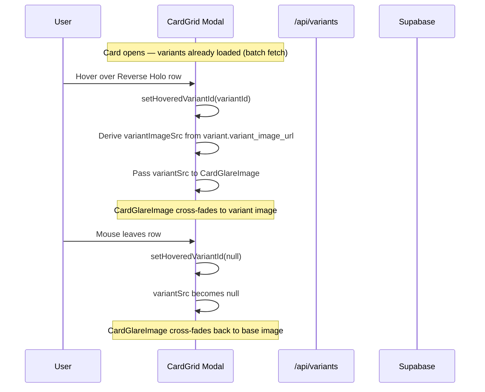

# Variant Image Hover Feature Plan

## Overview

When a user hovers over a variant row in the card modal (Card tab), **if** that variant has a dedicated image stored, the large card image on the left cross-fades smoothly to that variant's image. Hovering the default / quick-add variant, or any variant without a stored image, keeps the original card image visible.

---

## Current State Analysis

| Layer | Relevant file | Current behaviour |
|-------|--------------|-------------------|
| DB | `database/schema.sql` | `variants` table has **no** `image_url`. No per-card-variant image storage exists. |
| DB | `database/migration_card_variant_availability.sql` | Junction table (card↔variant) also has no image column. |
| API | `app/api/variants/route.ts` | Returns `VariantWithQuantity[]`; no image data. |
| Types | `types/index.ts` | `Variant` / `VariantWithQuantity` have no `variant_image_url`. |
| UI | `components/CardGrid.tsx` | `CardGlareImage` accepts a single `src` prop; no hover/transition logic. Variant rows have no hover image callback. |
| Admin | `components/admin/CardVariantEditor.tsx` | Manages which variants apply to a card; no image upload UI. |

---

## Architecture Decisions

### 1. New DB Table: `card_variant_images`

A dedicated table decoupled from the existing `card_variant_availability` junction table. This works for **all** cards — those using explicit CVA overrides AND those determined by rarity rules — without requiring a CVA row to exist.

```sql
create table if not exists public.card_variant_images (
  id          uuid not null default gen_random_uuid() primary key,
  card_id     uuid not null references public.cards(id) on delete cascade,
  variant_id  uuid not null references public.variants(id) on delete cascade,
  image_url   text not null,
  created_by  uuid references auth.users(id),
  created_at  timestamptz not null default now(),
  constraint unique_card_variant_image unique (card_id, variant_id)
);

create index if not exists idx_cvi_card_id    on public.card_variant_images(card_id);
create index if not exists idx_cvi_variant_id on public.card_variant_images(variant_id);

alter table public.card_variant_images enable row level security;

-- Public read (needed by variants API, called by unauthenticated users too)
create policy "cvi_read_all"
  on public.card_variant_images for select
  using (true);

-- Writes: service role only (API routes use supabaseAdmin which bypasses RLS)
```

Migration file: `database/migration_card_variant_images.sql`

### 2. Type Changes (`types/index.ts`)

Add `variant_image_url` to both `Variant` and `QuickAddVariant` so the data flows from DB → API → UI.

```ts
export interface Variant {
  // ... existing fields ...
  variant_image_url?: string | null   // NEW: per-card image for this variant (from card_variant_images)
}

export interface QuickAddVariant {
  // ... existing fields ...
  variant_image_url?: string | null   // NEW
}
```

`VariantWithQuantity extends Variant` so it inherits the field automatically.

### 3. API Update (`app/api/variants/route.ts`)

**GET** (single-card fetch) and **POST** (batch fetch) both need to join `card_variant_images` for the requested card(s) and attach `variant_image_url` to each variant in the response.

**Batch POST flow addition:**
```
1. Existing: fetch global variants, overrides, card-specific variants, rarity rules
2. NEW: fetch all card_variant_images rows for the batch card IDs
         → build map: { cardId → { variantId → image_url } }
3. When building the per-card variant list, set variant_image_url from the map
```

This keeps the batch response shape identical — just adds one extra nullable field per variant object.

### 4. `CardGlareImage` Cross-Fade Enhancement

The component currently stacks a single `` inside a 3D-tilt wrapper. The new design stacks **two** `` elements (base + variant) and drives `opacity` with a CSS transition.

```tsx
function CardGlareImage({
  src,              // base card image (always shown)
  variantSrc,       // optional variant image (shown on hover override)
  alt
}: {
  src: string | null | undefined
  variantSrc?: string | null
  alt?: string
}) {
  // ...existing RAF tilt logic unchanged...

  return (
    <div style={{ padding: 20, flexShrink: 0 }} onMouseMove={...} onMouseLeave={...}>
      <div ref={cardRef} className="w-[389px] h-[543px] bg-elevated rounded-xl overflow-hidden relative cursor-crosshair" style={{ willChange: 'transform' }}>
        
        {/* Base image — always present */}
        

        {/* Variant image — cross-fades over base; only rendered when variantSrc provided */}
        {variantSrc && (
          
        )}

        {/* Holographic glare overlay */}
        <div ref={glareRef} className="absolute inset-0 pointer-events-none z-10 transform-gpu" style={{ ... }} />
      </div>
    </div>
  )
}
```

The parent (`CardGrid`) controls which `variantSrc` is passed. When `variantSrc` is `null`/`undefined`, only the base image is visible. When it changes to a URL, the transition from `opacity: 0 → 1` (handled by CSS) creates the cross-fade. To make the cross-fade from variant back to base smooth, the variant img needs to start pre-loaded; a `useEffect` can preload the image when `variantSrc` is first received.

### 5. `CardGrid` Modal Hover Logic

Inside the existing modal JSX (Card tab variant rows), track which variant is being hovered:

```tsx
const [hoveredVariantId, setHoveredVariantId] = useState<string | null>(null)
```

Derive the image to pass to `CardGlareImage`:

```tsx
const hoveredVariant = hoveredVariantId
  ? filteredVariants.find(v => v.id === hoveredVariantId)
  : null

// Only swap image when:
//  1. There IS a hovered variant
//  2. It has a stored image
//  3. It is NOT the default/quick-add variant
const quickAddVariantId = selectedCard?.default_variant_id
  ?? filteredVariants.find(v => v.is_quick_add)?.id

const variantImageSrc =
  hoveredVariant &&
  hoveredVariant.variant_image_url &&
  hoveredVariant.id !== quickAddVariantId
    ? hoveredVariant.variant_image_url
    : null
```

Pass `variantImageSrc` to `CardGlareImage`:

```tsx
<CardGlareImage
  src={selectedCard.image_url}
  variantSrc={variantImageSrc}
  alt={selectedCard.name ?? undefined}
/>
```

On each variant row, add hover handlers:

```tsx
<div
  key={variant.id}
  onMouseEnter={() => setHoveredVariantId(variant.id)}
  onMouseLeave={() => setHoveredVariantId(null)}
  className="relative bg-elevated rounded-lg p-3 ..."
>
```

Reset `hoveredVariantId` to `null` when the modal closes (in the `onClose` handler).

### 6. Admin Upload API (`app/api/upload-variant-image/route.ts`)

A new Next.js route handler that:
1. Accepts `multipart/form-data` with fields: `file`, `cardId`, `variantId`
2. Validates the user is admin (via `supabaseAdmin` auth check)
3. Uploads the image to Supabase Storage (bucket: `card-images`, path: `variants/{cardId}/{variantId}.webp`) using the existing `imageCompress` utility
4. Upserts a row in `card_variant_images` with the resulting public URL
5. Returns `{ url: string }`

### 7. Admin UI (inside `CardVariantEditor.tsx`)

Add a small image-upload affordance next to each variant row (both global overrides and card-specific variants). The UI shows:
- A thumbnail of the current variant image if one exists (fetched alongside variant data)
- A "📷 Upload variant image" button that opens a file picker
- On selection: calls `POST /api/upload-variant-image` and updates local state with the new URL
- A "🗑 Remove" icon to delete the `card_variant_images` row

The `CardVariantEditor` already fetches variant data via `GET /api/variants?cardId=...`; after the API update, this response will include `variant_image_url` per variant which can seed the local state.

---

## Data Flow Diagram



```mermaid
flowchart TD
  A[Batch variant fetch on set page load] --> B[/api/variants POST]
  B --> C{Join card_variant_images}
  C --> D[variant.variant_image_url populated]
  D --> E[Stored in cardVariants Map in CardGrid]
  E --> F[Modal opens]
  F --> G[Hover variant row]
  G --> H{variant_image_url exists AND not quick-add?}
  H -- Yes --> I[CardGlareImage shows variant image]
  H -- No --> J[CardGlareImage keeps base image]
```

---

## File Change Summary

| File | Change type | What changes |
|------|-------------|--------------|
| `database/migration_card_variant_images.sql` | **New** | Creates `card_variant_images` table, indexes, RLS |
| `types/index.ts` | **Edit** | Add `variant_image_url?: string \| null` to `Variant` and `QuickAddVariant` |
| `app/api/variants/route.ts` | **Edit** | JOIN `card_variant_images` in GET + POST, attach `variant_image_url` |
| `app/api/upload-variant-image/route.ts` | **New** | Upload handler: compress → Storage → upsert DB row |
| `components/CardGrid.tsx` | **Edit** | Add `hoveredVariantId` state; derive `variantImageSrc`; pass to `CardGlareImage`; add `onMouseEnter`/`onMouseLeave` to variant rows; update `CardGlareImage` signature |
| `components/admin/CardVariantEditor.tsx` | **Edit** | Show variant image thumbnails; add upload button per row; call new upload API |

---

## UX Notes

- **No hover → no change**: If a variant has no `variant_image_url`, hovering it does nothing visible. This is intentional — the feature is additive, not disruptive.
- **Quick-add variant excluded**: Hovering the default quick-add variant (Normal) never triggers a swap since the card image already IS that variant's image.
- **Smooth transition**: `opacity` transition at `300ms ease-in-out` matches the rest of the app's card transitions. The base image always remains underneath so there is no blank flash during the cross-fade.
- **Image preloading**: The variant images are already known at modal-open time (from the batch fetch). A brief `useEffect` can create `new Image()` instances to warm the browser cache on mount, making first-hover seamless.
- **3D tilt preserved**: The `CardGlareImage` tilt/glare logic is fully preserved; variant images sit in the same stacking context and tilt identically.
